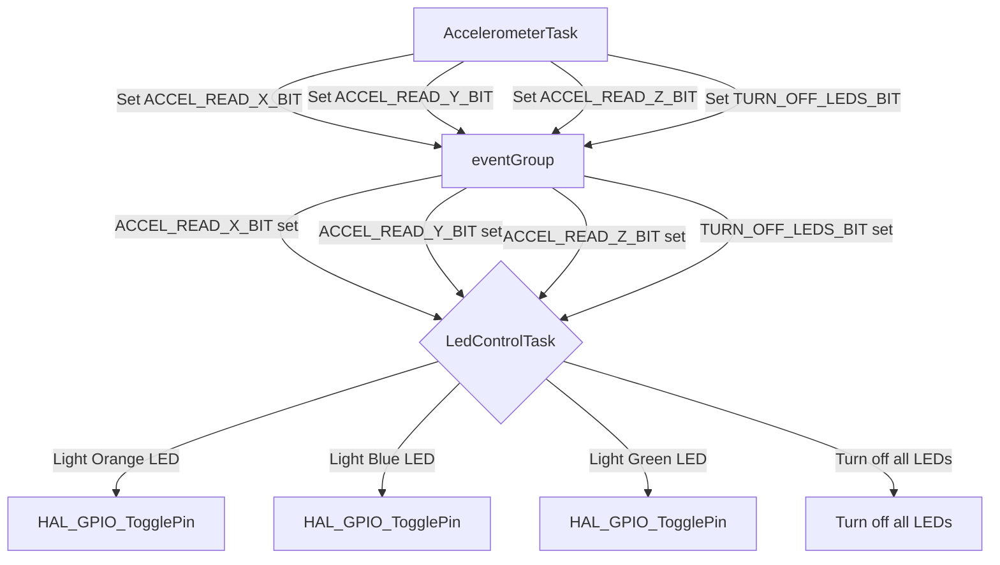

# Event Groups

## Overview

This document provides an overview of the event groups used in the project to handle synchronization between tasks. Event groups allow tasks to synchronize with each other based on multiple event flags. The project uses an event group to synchronize tasks related to accelerometer readings and LED indications.

## Event Group: `ledEventGroup`

### Purpose
The `ledEventGroup` is used to synchronize tasks that handle accelerometer data readings from the x, y, and z-axes and control the LEDs accordingly. Each axis reading sets a specific event bit, which triggers the LED task to light the corresponding LED. The `acc_task` could have directly set the LEDs within its own task, but using the event group (1) adds organization to the project, such that LED control is done exclusively in the `led_task`; and (2) demonstrates how event groups can be used for task synchronization within FreeRTOS.

### Configuration
- **Type**: Event Group
- **Bits**: 
    - `ACCEL_READ_X_BIT` (1 << 0): Indicates a successful x-axis reading.
    - `ACCEL_READ_Y_BIT` (1 << 1): Indicates a successful y-axis reading.
    - `ACCEL_READ_Z_BIT` (1 << 2): Indicates a successful z-axis reading.
    - `TURN_OFF_LEDS_BIT` (1 << 3): Indicates a all LEDs should be turned off (ex. transitioning from accelerometer menu back to main menu).

### Usage
- **Producer**: `acc_task`
- **Consumer**: `led_task`

### Code Snippets

#### Initialization
```c
ledEventGroup = xEventGroupCreate();
configASSERT(NULL != ledEventGroup);
```

#### Producer: `acc_task`
```c
void acc_task(void* param)
{
	uint32_t msg_addr;
	message_t *msg;
	int16_t acc_data[3];		// Array to hold accelerometer values
	char acc_flag[3] = {0};		// Array to hold new data flags

	while(1) {
		// Wait for notification from another task
		xTaskNotifyWait(0, 0, NULL, portMAX_DELAY);

		// Display Accelerometer menu for the user
		xQueueSend(q_print, &msg_acc_menu, portMAX_DELAY);

		// Wait for the user to make a selection
		xTaskNotifyWait(0, 0, &msg_addr, portMAX_DELAY);
		msg = (message_t*)msg_addr;

		// Set all new data flags to 0
		for(int i=0; i<3; i++) {
			acc_flag[i] = 0;
		}

		// Process command
		if(msg->len <= 4) {
			if(!strcmp((char*)msg->payload, "X")) {
				// Read accelerometer for X-axis only
				accelerometer_read(acc_data);						// Read data
				acc_flag[0] = 1; 									// Set X-axis new data flag
				show_acc_data(acc_data, acc_flag);					// Show data
				xEventGroupSetBits(ledEventGroup, ACCEL_READ_X_BIT);	// Set X-axis event group bit for LED task synchronization
			}
			else if(!strcmp((char*)msg->payload, "Y")) {
				// Read accelerometer for X-axis only
				accelerometer_read(acc_data);						// Read data
				acc_flag[1] = 1; 									// Set Y-axis new data flag
				show_acc_data(acc_data, acc_flag);					// Show data
				xEventGroupSetBits(ledEventGroup, ACCEL_READ_Y_BIT); 	// Set Y-axis event group bit for LED task synchronization
			}
			else if(!strcmp((char*)msg->payload, "Z")) {
				// Read accelerometer for X-axis only
				accelerometer_read(acc_data);						// Read data
				acc_flag[2] = 1; 									// Set Z-axis new data flag
				show_acc_data(acc_data, acc_flag);					// Show data
				xEventGroupSetBits(ledEventGroup, ACCEL_READ_Z_BIT);	// Set Z-axis event group bit for LED task synchronization
			}
			else if(!strcmp((char*)msg->payload, "All")) {
				accelerometer_read(acc_data);						// Read data
				for(int i=0; i<3; i++) acc_flag[i] = 1; 			// Set new data flags for all axes
				show_acc_data(acc_data, acc_flag);					// Show data
				// Set all event group bits for LED task synchronization
				xEventGroupSetBits(ledEventGroup, ACCEL_READ_X_BIT);
				xEventGroupSetBits(ledEventGroup, ACCEL_READ_Y_BIT);
				xEventGroupSetBits(ledEventGroup, ACCEL_READ_Z_BIT);
			}
			else if (!strcmp((char*)msg->payload, "Main")) {
				// Update the system state
				curr_sys_state = sMainMenu;

				// Set event group bit to turn off all LEDs upon exiting accelerometer menu
				xEventGroupSetBits(ledEventGroup, TURN_OFF_LEDS_BIT);

				// Notify the main menu task
				xTaskNotify(handle_main_menu_task, 0, eNoAction);
			}
			else {
				xQueueSend(q_print, &msg_inv_acc, portMAX_DELAY);
			}
		}
		else {
			// If user input is longer than 4 characters, notify user of invalid response
			xQueueSend(q_print, &msg_inv_acc, portMAX_DELAY);
		}

		// Notify self / accelerometer task if not returning to the main menu
		if (sAccMenu == curr_sys_state)
			xTaskNotify(handle_acc_task, 0, eNoAction);
	}
}
```

#### Consumer: `led_task`
```c
void led_task(void *param)
{
	// Communication variables
	uint32_t msg_addr;
	message_t *msg;

	// LED timer parameters
	int freq = 2; // Frequency in Hz
	int period = 500; // Period in ms

	// FreeRTOS variables
	const TickType_t xTicksToWait = pdMS_TO_TICKS(LED_WAIT_TIME); // Wait period for the event group
	uint32_t notificationValue;
	EventBits_t eventBits;

	while(1) {
		// Wait for task notification or timeout =========================================================================
		if (xTaskNotifyWait(0, 0, &notificationValue, xTicksToWait) == pdPASS) {										//
																														//
			// Display LED menu for the user																			//
			xQueueSend(q_print, &msg_led_menu, portMAX_DELAY);															//
																														//
			// Wait for the user to select their desired LED effect														//
			xTaskNotifyWait(0, 0, &msg_addr, portMAX_DELAY);															//
			msg = (message_t*)msg_addr;																					//
																														//
			// Process command, adjust LED state, and set software timers accordingly									//
			if(msg->len <= 4) {																							//
				if(!strcmp((char*)msg->payload, "None"))			// No effect										//
				{																										//
					set_led_timer(effectNone);																			//
					curr_led_state = sNone;																				//
					control_all_leds(LED_OFF);																			//
				}																										//
				else if (!strcmp((char*)msg->payload, "E1")) {		// E1 effect										//
					curr_led_state = sEffectE1;																			//
					set_led_timer(effectE1);																			//
				}																										//
				else if (!strcmp((char*)msg->payload, "E2")) {		// E2 effect										//
					curr_led_state = sEffectE2;																			//
					set_led_timer(effectE2);																			//
				}																										//
				else if (!strcmp((char*)msg->payload, "E3")) {		// E3 effect										//
					curr_led_state = sEffectE3;																			//
					set_led_timer(effectE3);																			//
				}																										//
				else if (!strcmp((char*)msg->payload, "E4")) {		// E4 effect										//
					curr_led_state = sEffectE4;																			//
					set_led_timer(effectE4);																			//
				}																										//
				else if (!strcmp((char*)msg->payload, "Tor")) {		// Toggle orange LED								//
					set_led_timer(effectNone);																			//
					curr_led_state = sNone;																				//
					HAL_GPIO_TogglePin(ORANGE_LED_PORT, ORANGE_LED_PIN);												//
				}																										// N
				else if (!strcmp((char*)msg->payload, "Tgr")) {		// Toggle green LED									// O
					set_led_timer(effectNone);																			// T
					curr_led_state = sNone;																				// I
					HAL_GPIO_TogglePin(GREEN_LED_PORT, GREEN_LED_PIN);													// F
				}																										// I
				else if (!strcmp((char*)msg->payload, "Tbl")) {		// Toggle blue LED									// C
					set_led_timer(effectNone);																			// A
					curr_led_state = sNone;																				// T
					HAL_GPIO_TogglePin(BLUE_LED_PORT, BLUE_LED_PIN);													// I
				}																										// O
				else if (!strcmp((char*)msg->payload, "Tre")) {		// Toggle red LED									// N
					set_led_timer(effectNone);																			//
					curr_led_state = sNone;																				//
					HAL_GPIO_TogglePin(RED_LED_PORT, RED_LED_PIN);														//
				}																										//
				else if (parse_freq_string(msg, &freq)) {			// Frequency adjustment								//
					// Check that there is an active effect																//
					if(sNone == curr_led_state) {																		//
						xQueueSend(q_print, &msg_no_active_effect, portMAX_DELAY);										//
					}																									//
					// Check that frequency is between 1 and 10 Hz														//
					else if(freq > 10) {																				//
						xQueueSend(q_print, &msg_inv_freq, portMAX_DELAY);												//
					}																									//
					// Change timer frequency																			//
					else {																								//
						period = (1.0 / freq) * 1000;																	//
						if (xTimerChangePeriod(handle_led_timer[curr_led_state], pdMS_TO_TICKS(period), 0) != pdPASS) {	//
							// If frequency update was not successful, notify the user									//
							xQueueSend(q_print, &msg_err_freq, portMAX_DELAY);											//
						}																								//
					}																									//
				}																										//
				else if (!strcmp((char*)msg->payload, "Main")) {	// Back to main menu								//
					// Update the system state																			//
					curr_sys_state = sMainMenu;																			//
																														//
					// Notify the main menu task																		//
					xTaskNotify(handle_main_menu_task, 0, eNoAction);													//
				}																										//
				else												// Invalid response									//
					xQueueSend(q_print, &msg_inv_led, portMAX_DELAY);													//
			}																											//
			else {																										//
				// If user input is longer than 4 characters, notify user of invalid response							//
				xQueueSend(q_print, &msg_inv_led, portMAX_DELAY);														//
			}																											//
																														//
			// Notify self / led task if not returning to the main menu													//
			if (sLedMenu == curr_sys_state)																				//
				xTaskNotify(handle_led_task, 0, eNoAction);																//
		}	// ===========================================================================================================
		// If timeout, check for any LED event group bits set ------------------------------------------------------------
		eventBits =  xEventGroupWaitBits(																				//
				 	 ledEventGroup,																						//
		             ACCEL_READ_X_BIT | ACCEL_READ_Y_BIT | ACCEL_READ_Z_BIT | TURN_OFF_LEDS_BIT,						//
		             pdTRUE,  // Clear bits on exit																		//
		             pdFALSE, // Wait for any bit to be set																//
		             0);      // Do not block																			//
																														//
		if (eventBits & ACCEL_READ_X_BIT && eventBits & ACCEL_READ_Y_BIT && eventBits & ACCEL_READ_Z_BIT) {				//
			// Light all LED for x-, y-, and z-axis success																//
			set_led_timer(effectNone);																					//
			curr_led_state = sNone;																						//
			HAL_GPIO_WritePin(ORANGE_LED_PORT, ORANGE_LED_PIN, SET);													//
			HAL_GPIO_WritePin(BLUE_LED_PORT, BLUE_LED_PIN, SET);														//
			HAL_GPIO_WritePin(GREEN_LED_PORT, GREEN_LED_PIN, SET);														//
		}																												//
		else if (eventBits & TURN_OFF_LEDS_BIT) {																		//
			// Turn off all LEDs																						// E
			set_led_timer(effectNone);																					// V
			curr_led_state = sNone;																						// E
			control_all_leds(LED_OFF);																					// N
		}																												// T
		else if (eventBits & ACCEL_READ_X_BIT) {																		//
			// Light orange LED for x-axis success																		// G
			set_led_timer(effectNone);																					// R
			curr_led_state = sNone;																						// O
			HAL_GPIO_WritePin(ORANGE_LED_PORT, ORANGE_LED_PIN, SET);													// U
			HAL_GPIO_WritePin(BLUE_LED_PORT, BLUE_LED_PIN, RESET);														// P
			HAL_GPIO_WritePin(GREEN_LED_PORT, GREEN_LED_PIN, RESET);													//
		}																												//
		else if (eventBits & ACCEL_READ_Y_BIT) {																		//
			// Light blue LED for y-axis success																		//
			set_led_timer(effectNone);																					//
			curr_led_state = sNone;																						//
			HAL_GPIO_WritePin(ORANGE_LED_PORT, ORANGE_LED_PIN, RESET);													//
			HAL_GPIO_WritePin(BLUE_LED_PORT, BLUE_LED_PIN, SET);														//
			HAL_GPIO_WritePin(GREEN_LED_PORT, GREEN_LED_PIN, RESET);													//
		}																												//
		else if (eventBits & ACCEL_READ_Z_BIT) {																		//
			// Light green LED for z-axis success																		//
			set_led_timer(effectNone);																					//
			curr_led_state = sNone;																						//
			HAL_GPIO_WritePin(ORANGE_LED_PORT, ORANGE_LED_PIN, RESET);													//
			HAL_GPIO_WritePin(BLUE_LED_PORT, BLUE_LED_PIN, RESET);														//
			HAL_GPIO_WritePin(GREEN_LED_PORT, GREEN_LED_PIN, SET);														//
		}	// -----------------------------------------------------------------------------------------------------------

	} // end while super loop
}
```

## Event Group Interaction

### Data Flow

1. **Data Reception:** The `acc_task` reads data from the accelerometer and sets the corresponding event bits (`ACCEL_READ_X_BIT`, `ACCEL_READ_Y_BIT`, `ACCEL_READ_Z_BIT`, or `TURN_OFF_LEDS_BIT`) in the eventGroup.
2. **Event Handling:** The `led_task` waits for the event bits to be set using xEventGroupWaitBits().
3. **LED indication:** When an event bit is set, the `led_task` lights the corresponding LED (orange for x-axis, blue for y-axis, green for z-axis) or turns all LEDs off.

### Sequence diagram

