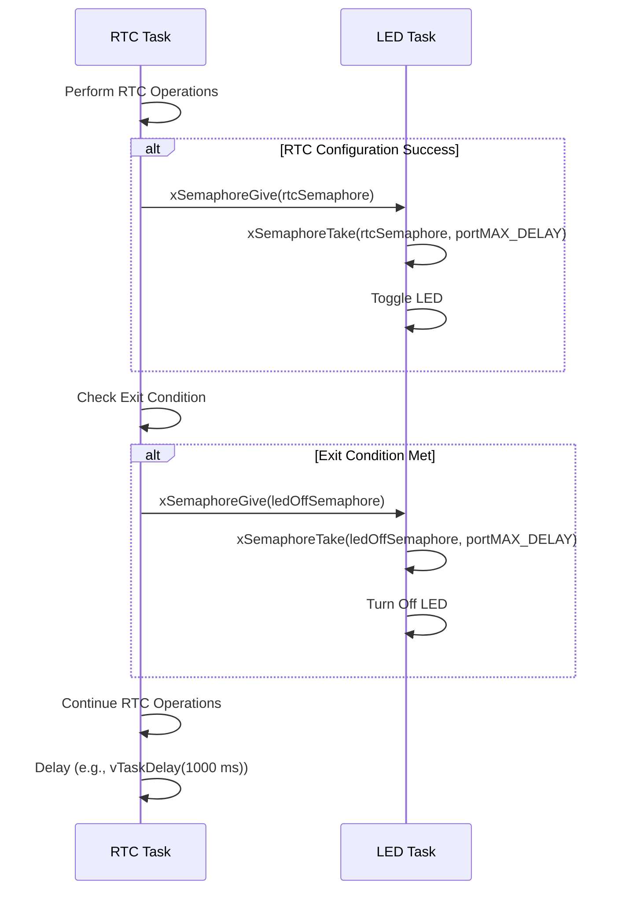

# Semaphores

## Overview

This document provides an overview of the semaphores used in the project to synchronize tasks. There are two main semaphores:

1. **RTC Semaphore (`rtcSemaphore`)**: Used to synchronize the RTC task with the LED task to light an LED upon successful RTC configuration.
2. **LED Off Semaphore (`ledOffSemaphore`)**: Used to turn off LEDs when exiting the RTC configuration.

## Semaphore: `rtcSemaphore`

### Purpose
The `rtcSemaphore` is used to synchronize the RTC task with the LED task, ensuring that the LED task indicates successful RTC configuration by lighting an LED.

### Configuration
- **Type**: Semaphore
- **Mode**: Binary

### Usage
- **Producer**: `rtc_task`
- **Consumer**: `led_task`

### Code Snippets

#### Initialization
```c
rtcSemaphore = xSemaphoreCreateBinary();
configASSERT(NULL != rtcSemaphore);
```

#### Producer: `rtc_task`
```c
void rtc_task(void *param)
{
	uint32_t msg_addr;
	message_t *msg;

	while(1) {

		// Wait for notification from another task
		xTaskNotifyWait(0, 0, NULL, portMAX_DELAY);

		while(curr_sys_state != sMainMenu) {

			switch(curr_sys_state) {
				/***** RTC main menu state *****/
				case sRtcMenu:
					// Display RTC menu for the user, show current time and date
					xQueueSend(q_print, &msg_rtc_menu_1, portMAX_DELAY);
					show_time_date();
					xQueueSend(q_print, &msg_rtc_menu_2, portMAX_DELAY);

					// Wait for the user to select their desired RTC configuration option
					xTaskNotifyWait(0, 0, &msg_addr, portMAX_DELAY);
					msg = (message_t*)msg_addr;

					// Process command, update date / time accordingly
					if(msg->len <= 4) {
						if(!strcmp((char*)msg->payload, "Date")) {			// Configure date
							// Update the system state
							curr_sys_state = sRtcDateConfig;
							xQueueSend(q_print, &msg_rtc_mo, portMAX_DELAY);
						}
						else if (!strcmp((char*)msg->payload, "Time")) {	// Configure time
							// Update the system state
							curr_sys_state = sRtcTimeConfig;
							xQueueSend(q_print, &msg_rtc_hh, portMAX_DELAY);
						}
						else if (!strcmp((char*)msg->payload, "Rfsh")) {	// Refresh the date and time
							// Update the system state
							curr_sys_state = sRtcMenu;
						}
						else if (!strcmp((char*)msg->payload, "Main")) {	// Back to main menu
							// Update the system state
							curr_sys_state = sMainMenu;
							// Give semaphore for led_task to turn LEDs off
							xSemaphoreGive(ledOffSemaphore);
						}
						else {												// Invalid response
							// Update the system state
							curr_sys_state = sMainMenu;
							xQueueSend(q_print, &msg_inv_rtc, portMAX_DELAY);
							// Give semaphore for led_task to turn LEDs off
							xSemaphoreGive(ledOffSemaphore);
						}
					}
					else {
						// If user input is longer than 4 characters, notify user of invalid response
						curr_sys_state = sMainMenu;
						xQueueSend(q_print, &msg_inv_rtc, portMAX_DELAY);
					}
					break;
				/***** RTC date configuration state *****/
				case sRtcDateConfig:
					// Wait for the user to select their desired RTC configuration option
					xTaskNotifyWait(0, 0, &msg_addr, portMAX_DELAY);
					msg = (message_t*)msg_addr;

					// Configure month, date, year, or day of week accordingly
					switch(curr_rtc_state) {
						case MONTH_CONFIG:									// Month config
							uint8_t m = getnumber(msg->payload, msg->len);
							date.Month = m;
							curr_rtc_state = DATE_CONFIG;
							xQueueSend(q_print, &msg_rtc_dd, portMAX_DELAY);
							break;
						case DATE_CONFIG:									// Date config
							uint8_t d = getnumber(msg->payload, msg->len);
							date.Date = d;
							curr_rtc_state = YEAR_CONFIG;
							xQueueSend(q_print, &msg_rtc_yr, portMAX_DELAY);
							break;
						case YEAR_CONFIG:									// Year config
							uint8_t y = getnumber(msg->payload, msg->len);
							date.Year = y;
							curr_rtc_state = DAY_CONFIG;
							xQueueSend(q_print, &msg_rtc_dow, portMAX_DELAY);
							break;
						case DAY_CONFIG:									// Day of week config
							uint8_t day = getnumber(msg->payload, msg->len);
							date.WeekDay = day;

							// Check that the user entered a valid date entry, configure date
							if(!validate_rtc_information(NULL, &date)) {
								rtc_configure_date(&date); // Configure date
								xQueueSend(q_print, &msg_conf, portMAX_DELAY); // Send confirmation to print queue
								xSemaphoreGive(rtcSemaphore); // Give rtcSemaphore for led_task to light LED
							}
							else {
								xQueueSend(q_print, &msg_inv_rtc, portMAX_DELAY);
								// Give semaphore for led_task to turn LEDs off
								xSemaphoreGive(ledOffSemaphore);
							}

							// Update system state, send control back to RTC menu
							curr_sys_state = sRtcMenu;
							curr_rtc_state = 0;
							break;
					}
					break;
				/***** RTC time configuration state *****/
				case sRtcTimeConfig:
					// Wait for the user to select their desired RTC configuration option
					xTaskNotifyWait(0, 0, &msg_addr, portMAX_DELAY);
					msg = (message_t*)msg_addr;

					// Configure hours, minutes, or seconds accordingly
					switch(curr_rtc_state) {
						case HH_CONFIG:
							uint8_t hour = getnumber(msg->payload, msg->len);
							time.Hours = hour;
							curr_rtc_state = MM_CONFIG;
							xQueueSend(q_print, &msg_rtc_mm, portMAX_DELAY);
							break;
						case MM_CONFIG:
							uint8_t min = getnumber(msg->payload, msg->len);
							time.Minutes = min;
							curr_rtc_state = SS_CONFIG;
							xQueueSend(q_print, &msg_rtc_ss, portMAX_DELAY);
							break;
						case SS_CONFIG:
							uint8_t sec = getnumber(msg->payload, msg->len);
							time.Seconds = sec;
							curr_rtc_state = AMPM_CONFIG;
							xQueueSend(q_print, &msg_rtc_ampm, portMAX_DELAY);
							break;
						case AMPM_CONFIG:
							uint8_t opt = getnumber(msg->payload, msg->len);
							time.TimeFormat = opt; // Note: 0 = RTC_HOURFORMAT12_AM, 1 = RTC_HOURFORMAT12_PM
							
							// Check that the user entered a valid date entry, configure time
							if(!validate_rtc_information(&time, NULL)) {
								rtc_configure_time(&time); // Configure time
								xQueueSend(q_print, &msg_conf, portMAX_DELAY); // Send confirmation to print queue
								xSemaphoreGive(rtcSemaphore); // Give rtcSemaphore for led_task to light LED
							}
							else {
								xQueueSend(q_print, &msg_inv_rtc, portMAX_DELAY);
								// Give semaphore for led_task to turn LEDs off
								xSemaphoreGive(ledOffSemaphore);
							}
							// Update system state, send control back to RTC menu
							curr_sys_state = sRtcMenu;
							curr_rtc_state = 0;
							break;
					}
					break;
				default:
					// Return control to the main menu task
					curr_sys_state = sMainMenu;
					xQueueSend(q_print, &msg_inv_rtc, portMAX_DELAY);
					// Give semaphore for led_task to turn LEDs off
					xSemaphoreGive(ledOffSemaphore);
					break;
			}

		} // while end

		// Notify the main menu task
		xTaskNotify(handle_main_menu_task, 0, eNoAction);

	} // while super loop end
}
```

#### Consumer: `led_task`
```c
void led_task(void *param)
{
	// Communication variables
	uint32_t msg_addr;
	message_t *msg;

	// LED timer parameters
	int freq = 2; // Frequency in Hz
	int period = 500; // Period in ms

	// FreeRTOS variables
	const TickType_t xTicksToWait = pdMS_TO_TICKS(EVENT_GROUP_WAIT_TIME); // Wait period for the event group
	uint32_t notificationValue;
	EventBits_t eventBits;

	while(1) {
		// Wait for task notification or timeout =========================================================================
		if (xTaskNotifyWait(0, 0, &notificationValue, xTicksToWait) == pdPASS) {										//
																														//
			// Display LED menu for the user																			//
			xQueueSend(q_print, &msg_led_menu, portMAX_DELAY);															//
																														//
			// Wait for the user to select their desired LED effect														//
			xTaskNotifyWait(0, 0, &msg_addr, portMAX_DELAY);															//
			msg = (message_t*)msg_addr;																					//
																														//
			// Process command, adjust LED state, and set software timers accordingly									//
			if(msg->len <= 4) {																							//
				if(!strcmp((char*)msg->payload, "None"))			// No effect										//
				{																										//
					set_led_timer(effectNone);																			//
					curr_led_state = sNone;																				//
					control_all_leds(LED_OFF);																			//
				}																										//
				else if (!strcmp((char*)msg->payload, "E1")) {		// E1 effect										//
					curr_led_state = sEffectE1;																			//
					set_led_timer(effectE1);																			//
				}																										//
				else if (!strcmp((char*)msg->payload, "E2")) {		// E2 effect										//
					curr_led_state = sEffectE2;																			//
					set_led_timer(effectE2);																			//
				}																										//
				else if (!strcmp((char*)msg->payload, "E3")) {		// E3 effect										//
					curr_led_state = sEffectE3;																			//
					set_led_timer(effectE3);																			//
				}																										//
				else if (!strcmp((char*)msg->payload, "E4")) {		// E4 effect										//
					curr_led_state = sEffectE4;																			//
					set_led_timer(effectE4);																			//
				}																										//
				else if (!strcmp((char*)msg->payload, "Tor")) {		// Toggle orange LED								//
					set_led_timer(effectNone);																			//
					curr_led_state = sNone;																				//
					HAL_GPIO_TogglePin(ORANGE_LED_PORT, ORANGE_LED_PIN);												//
				}																										// N
				else if (!strcmp((char*)msg->payload, "Tgr")) {		// Toggle green LED									// O
					set_led_timer(effectNone);																			// T
					curr_led_state = sNone;																				// I
					HAL_GPIO_TogglePin(GREEN_LED_PORT, GREEN_LED_PIN);													// F
				}																										// I
				else if (!strcmp((char*)msg->payload, "Tbl")) {		// Toggle blue LED									// C
					set_led_timer(effectNone);																			// A
					curr_led_state = sNone;																				// T
					HAL_GPIO_TogglePin(BLUE_LED_PORT, BLUE_LED_PIN);													// I
				}																										// O
				else if (!strcmp((char*)msg->payload, "Tre")) {		// Toggle red LED									// N
					set_led_timer(effectNone);																			//
					curr_led_state = sNone;																				//
					HAL_GPIO_TogglePin(RED_LED_PORT, RED_LED_PIN);														//
				}																										//
				else if (parse_freq_string(msg, &freq)) {			// Frequency adjustment								//
					// Check that there is an active effect																//
					if(sNone == curr_led_state) {																		//
						xQueueSend(q_print, &msg_no_active_effect, portMAX_DELAY);										//
					}																									//
					// Check that frequency is between 1 and 10 Hz														//
					else if(freq > 10) {																				//
						xQueueSend(q_print, &msg_inv_freq, portMAX_DELAY);												//
					}																									//
					// Change timer frequency																			//
					else {																								//
						period = (1.0 / freq) * 1000;																	//
						if (xTimerChangePeriod(handle_led_timer[curr_led_state], pdMS_TO_TICKS(period), 0) != pdPASS) {	//
							// If frequency update was not successful, notify the user									//
							xQueueSend(q_print, &msg_err_freq, portMAX_DELAY);											//
						}																								//
					}																									//
				}																										//
				else if (!strcmp((char*)msg->payload, "Main")) {	// Back to main menu								//
					// Update the system state																			//
					curr_sys_state = sMainMenu;																			//
																														//
					// Notify the main menu task																		//
					xTaskNotify(handle_main_menu_task, 0, eNoAction);													//
				}																										//
				else												// Invalid response									//
					xQueueSend(q_print, &msg_inv_led, portMAX_DELAY);													//
			}																											//
			else {																										//
				// If user input is longer than 4 characters, notify user of invalid response							//
				xQueueSend(q_print, &msg_inv_led, portMAX_DELAY);														//
			}																											//
																														//
			// Notify self / led task if not returning to the main menu													//
			if (sLedMenu == curr_sys_state)																				//
				xTaskNotify(handle_led_task, 0, eNoAction);																//
		}	// ===========================================================================================================
		// If timeout, check for any LED event group bits set ------------------------------------------------------------
		eventBits =  xEventGroupWaitBits(																				//
				 	 ledEventGroup,																						//
		             ACCEL_READ_X_BIT | ACCEL_READ_Y_BIT | ACCEL_READ_Z_BIT | TURN_OFF_LEDS_BIT,						//
		             pdTRUE,  // Clear bits on exit																		//
		             pdFALSE, // Wait for any bit to be set																//
		             0);      // Do not block																			//
																														//
		if ((eventBits & ACCEL_READ_X_BIT) && (eventBits & ACCEL_READ_Y_BIT) && (eventBits & ACCEL_READ_Z_BIT)) {		//
			// Light all LED for x-, y-, and z-axis success																//
			set_led_timer(effectNone);																					//
			curr_led_state = sNone;																						//
			HAL_GPIO_WritePin(ORANGE_LED_PORT, ORANGE_LED_PIN, SET);													//
			HAL_GPIO_WritePin(BLUE_LED_PORT, BLUE_LED_PIN, SET);														//
			HAL_GPIO_WritePin(GREEN_LED_PORT, GREEN_LED_PIN, SET);														//
		}																												//
		else if (eventBits & TURN_OFF_LEDS_BIT) {																		// E
			// Turn off all LEDs																						// V
			set_led_timer(effectNone);																					// E
			curr_led_state = sNone;																						// N
			control_all_leds(LED_OFF);																					// T
		}																												//
		else if (eventBits & ACCEL_READ_X_BIT) {																		// G
			// Light orange LED for x-axis success																		// R
			set_led_timer(effectNone);																					// O
			curr_led_state = sNone;																						// U
			control_all_leds(LED_OFF);																					// P
			HAL_GPIO_WritePin(ORANGE_LED_PORT, ORANGE_LED_PIN, SET);													//
		}																												//
		else if (eventBits & ACCEL_READ_Y_BIT) {																		//
			// Light blue LED for y-axis success																		//
			set_led_timer(effectNone);																					//
			curr_led_state = sNone;																						//
			control_all_leds(LED_OFF);																					//
			HAL_GPIO_WritePin(BLUE_LED_PORT, BLUE_LED_PIN, SET);														//
		}																												//
		else if (eventBits & ACCEL_READ_Z_BIT) {																		//
			// Light green LED for z-axis success																		//
			set_led_timer(effectNone);																					//
			curr_led_state = sNone;																						//
			control_all_leds(LED_OFF);																					//
			HAL_GPIO_WritePin(GREEN_LED_PORT, GREEN_LED_PIN, SET);														//
		}	// -----------------------------------------------------------------------------------------------------------
		// ===============================================================================================================
		// Check if rtcSemaphore is available																			//
		if (xSemaphoreTake(rtcSemaphore, RTC_SEMAPHORE_WAIT_TIME) == pdTRUE) {											// S
			// Light red LED to indicate successful RTC configuration													// E
			set_led_timer(effectNone);																					// M
			curr_led_state = sNone;																						// A
			control_all_leds(LED_OFF);																					// P
			HAL_GPIO_WritePin(RED_LED_PORT, RED_LED_PIN, SET);															// H
		} 																												// O
		if (xSemaphoreTake(ledOffSemaphore, RTC_SEMAPHORE_WAIT_TIME) == pdTRUE) {										// R
			// Turn off all LEDs																						// E
			set_led_timer(effectNone);																					// S
			curr_led_state = sNone;																						//
			control_all_leds(LED_OFF);																					//
		} // =============================================================================================================


	} // end while super loop
}
```

## Semaphore: `ledOffSemaphore`

### Purpose
The `ledOffSemaphore` is used to synchronize tasks to turn off the LEDs when exiting the RTC configuration.

### Configuration
- **Type**: Semaphore
- **Mode**: Binary

### Usage
- **Producer**: `rtc_task`
- **Consumer**: `led_task`

### Code Snippets

#### Initialization
```c
ledOffSemaphore = xSemaphoreCreateBinary();
configASSERT(NULL != ledOffSemaphore);
```

#### Producer: `rtc_task`

_See code snippet above_

#### Consumer: `led_task`

_See code snippet above_

## Semaphore Interaction

### Data Flow

1. **RTC Synchronization:** The `rtc_task` performs RTC operations and signals the `led_task` using `rtcSemaphore` when an RTC configuration is successfully completed.
2. **LED Indication:** The `led_task` waits for the `rtcSemaphore` and toggles the LED when the semaphore is given.
3. **Exit RTC Configuration:** The `rtc_task` signals the `led_task` to turn off LEDs using the `ledOffSemaphore` when exiting the RTC configuration.
4. **Turn LEDs Off:** The `led_task` waits for the `ledOffSemaphore` and turns off the LEDs when the semaphore is given.

### Sequence diagram

