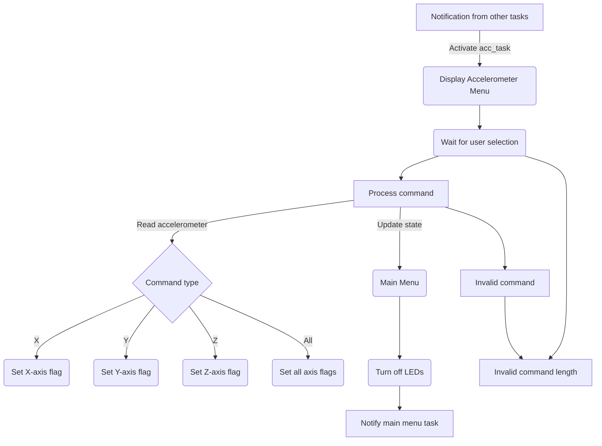
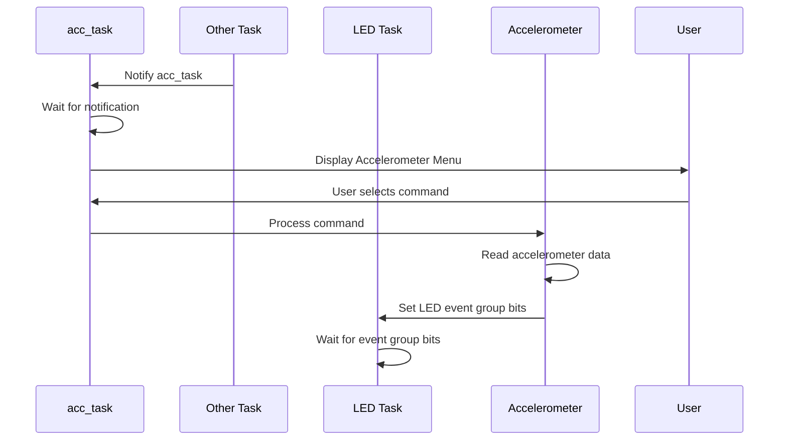

# AccManager Task Documentation

## AccManager: acc task
### Overview
The `acc_task` is responsible for managing accelerometer data and user interactions related to accelerometer functionality. It processes user commands to read accelerometer data for specific axes (X, Y, Z) or all axes, displays the data, and synchronizes LED indications using event groups based on the readings.


### Task Description
- **Task Name:** acc_task
- **Priority:** 2
- **Stack Size:** 1000 bytes (250 words)
- **File Location:** `Core/Src/AccManager/AccManager.c`
- **Header File Location:** `Core/Inc/AccManager/AccManager.h`
- **Config File Location:** `Core/Inc/AccManager/Config_AccManager.h`

### Functionality
#### Purpose
The `acc_task` performs the following functions:
- Receives notifications from other tasks to activate.
- Displays an accelerometer menu for user interaction.
- Reads accelerometer data based on user commands for X, Y, Z axes, or all axes.
- Sets event group bits for LED task synchronization based on accelerometer readings.


#### Code Snippet
```c
void acc_task(void* param)
{
	uint32_t msg_addr;
	message_t *msg;
	int16_t acc_data[3];		// Array to hold accelerometer values
	char acc_flag[3] = {0};		// Array to hold new data flags

	while(1) {
		// Wait for notification from another task
		xTaskNotifyWait(0, 0, NULL, portMAX_DELAY);

		// Display Accelerometer menu for the user
		xQueueSend(q_print, &msg_acc_menu, portMAX_DELAY);

		// Wait for the user to make a selection
		xTaskNotifyWait(0, 0, &msg_addr, portMAX_DELAY);
		msg = (message_t*)msg_addr;

		// Set all new data flags to 0
		for(int i=0; i<3; i++) {
			acc_flag[i] = 0;
		}

		// Process command
		if(msg->len <= 4) {
			if(!strcmp((char*)msg->payload, "X")) {
				// Read accelerometer for X-axis only
				accelerometer_read(acc_data);						// Read data
				acc_flag[0] = 1; 									// Set X-axis new data flag
				show_acc_data(acc_data, acc_flag);					// Show data
				xEventGroupSetBits(ledEventGroup, ACCEL_READ_X_BIT);	// Set X-axis event group bit for LED task synchronization
			}
			else if(!strcmp((char*)msg->payload, "Y")) {
				// Read accelerometer for X-axis only
				accelerometer_read(acc_data);						// Read data
				acc_flag[1] = 1; 									// Set Y-axis new data flag
				show_acc_data(acc_data, acc_flag);					// Show data
				xEventGroupSetBits(ledEventGroup, ACCEL_READ_Y_BIT); 	// Set Y-axis event group bit for LED task synchronization
			}
			else if(!strcmp((char*)msg->payload, "Z")) {
				// Read accelerometer for X-axis only
				accelerometer_read(acc_data);						// Read data
				acc_flag[2] = 1; 									// Set Z-axis new data flag
				show_acc_data(acc_data, acc_flag);					// Show data
				xEventGroupSetBits(ledEventGroup, ACCEL_READ_Z_BIT);	// Set Z-axis event group bit for LED task synchronization
			}
			else if(!strcmp((char*)msg->payload, "All")) {
				accelerometer_read(acc_data);						// Read data
				for(int i=0; i<3; i++) acc_flag[i] = 1; 			// Set new data flags for all axes
				show_acc_data(acc_data, acc_flag);					// Show data
				// Set all event group bits for LED task synchronization
				xEventGroupSetBits(ledEventGroup, ACCEL_READ_X_BIT);
				xEventGroupSetBits(ledEventGroup, ACCEL_READ_Y_BIT);
				xEventGroupSetBits(ledEventGroup, ACCEL_READ_Z_BIT);
			}
			else if (!strcmp((char*)msg->payload, "Main")) {
				// Update the system state
				curr_sys_state = sMainMenu;

				// Set event group bit to turn off all LEDs upon exiting accelerometer menu
				xEventGroupSetBits(ledEventGroup, TURN_OFF_LEDS_BIT);

				// Notify the main menu task
				xTaskNotify(handle_main_menu_task, 0, eNoAction);
			}
			else {
				xQueueSend(q_print, &msg_inv_acc, portMAX_DELAY);
			}
		}
		else {
			// If user input is longer than 4 characters, notify user of invalid response
			xQueueSend(q_print, &msg_inv_acc, portMAX_DELAY);
		}

		// Notify self / accelerometer task if not returning to the main menu
		if (sAccMenu == curr_sys_state)
			xTaskNotify(handle_acc_task, 0, eNoAction);
	}
}
```

## Diagrams

### Data flow diagram


### Sequence diagram

