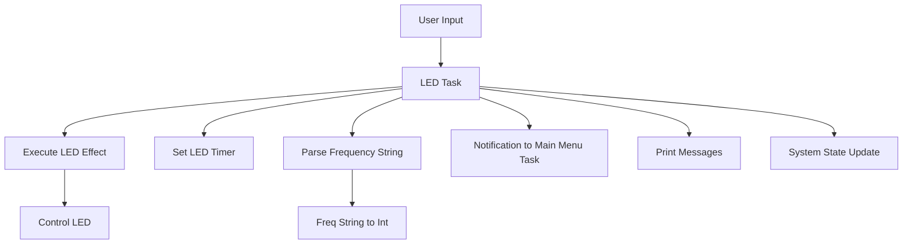
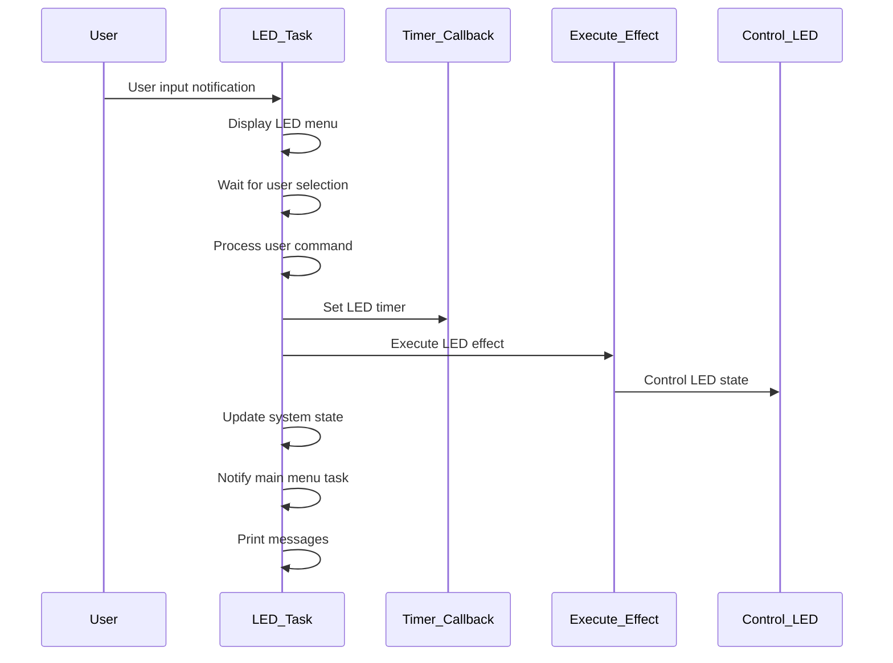

# LedManager Task Documentation

## LedManager: led task
### Overview
The `led_task` is responsible for displaying the LED menu and processing user input to apply different LED effects. It handles user selections for various predefined LED effects and frequency adjustments, and sends messages for invalid selections or errors.

### Task Description
- **Task Name:** led_task
- **Priority:** 2
- **Stack Size:** 1000 bytes (250 words)
- **File Location:** `Core/Src/LedManager/LedManager.c`
- **Header File Location:** `Core/Inc/LedManager/LedManager.h`
- **Config File Location:** `Core/Inc/LedManager/Config_LedManager.h`

### Functionality
#### Purpose
The `led_task` performs the following functions:
- Waits for notification from another task (the main menu task in this application)
- Displays the LED menu
- Processes the user input as it pertains to LED effects

#### Code Snippet
```c
void led_task(void *param)
{
	uint32_t msg_addr;
	message_t *msg;
	int freq = 2; // Frequency in Hz
	int period = 500; // Period in ms

	while(1) {
		// Wait for notification from another task
		xTaskNotifyWait(0, 0, NULL, portMAX_DELAY);

		// Display LED menu for the user
		xQueueSend(q_print, &msg_led_menu, portMAX_DELAY);

		// Wait for the user to select their desired LED effect
		xTaskNotifyWait(0, 0, &msg_addr, portMAX_DELAY);
		msg = (message_t*)msg_addr;

		// Process command, adjust LED state, and set software timers accordingly
		if(msg->len <= 4) {
			if(!strcmp((char*)msg->payload, "None"))			// No effect
			{
				set_led_timer(effectNone);
				curr_led_state = sNone;
				control_all_leds(LED_OFF);
			}
			else if (!strcmp((char*)msg->payload, "E1")) {		// E1 effect
				curr_led_state = sEffectE1;
				set_led_timer(effectE1);
			}
			else if (!strcmp((char*)msg->payload, "E2")) {		// E2 effect
				curr_led_state = sEffectE2;
				set_led_timer(effectE2);
			}
			else if (!strcmp((char*)msg->payload, "E3")) {		// E3 effect
				curr_led_state = sEffectE3;
				set_led_timer(effectE3);
			}
			else if (!strcmp((char*)msg->payload, "E4")) {		// E4 effect
				curr_led_state = sEffectE4;
				set_led_timer(effectE4);
			}
			else if (parse_freq_string(msg, &freq)) {			// Frequency adjustment
				// Check that there is an active effect
				if(sNone == curr_led_state) {
					xQueueSend(q_print, &msg_no_active_effect, portMAX_DELAY);
				}
				// Change timer frequency
				else {
					period = (1.0 / freq) * 1000;
					if (xTimerChangePeriod(handle_led_timer[curr_led_state], pdMS_TO_TICKS(period), 0) != pdPASS) {
						// If frequency update was not successful, notify the user
						xQueueSend(q_print, &msg_err_freq, portMAX_DELAY);
					}
				}
			}
			else if (!strcmp((char*)msg->payload, "Main"))		// Back to main menu
				// Do nothing
				;
			else												// Invalid response
				xQueueSend(q_print, &msg_inv_led, portMAX_DELAY);
		}
		else {
			// If user input is longer than 4 characters, notify user of invalid response
			xQueueSend(q_print, &msg_inv_led, portMAX_DELAY);
		}

		// Update the system state
		curr_sys_state = sMainMenu;

		// Notify the main menu task
		xTaskNotify(handle_main_menu_task, 0, eNoAction);
	}
}
```

## Diagrams

### Data flow diagram


### Sequence diagram

