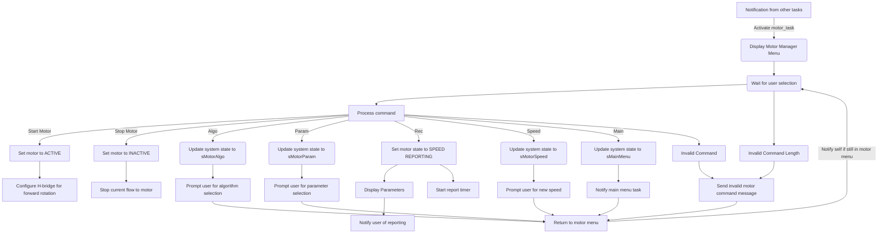
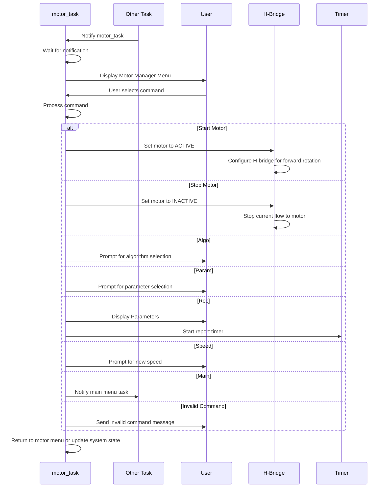

# MotorManager Task Documentation

## MotorManager: motor task
### Overview
The `motor_task` is responsible for managing the motor's operational states and user interactions related to motor functionality. It processes user commands to start or stop the motor, configure motor algorithms, set motor parameters, and manage speed settings. Additionally, it handles state transitions, motor reporting, and parameter initialization based on user inputs.

### Task Description
- **Task Name:** motor_task
- **Priority:** 2
- **Stack Size:** 1000 bytes (250 words)
- **File Location:** `Core/Src/MotorManager/MotorManager.c`
- **Header File Location:** `Core/Inc/MotorManager/MotorManager.h`
- **Config File Location:** `Core/Inc/MotorManager/Config_MotorManager.h`

### Functionality
#### Purpose
The `motor_task` performs the following functions:
- Receives notifications from other tasks to activate.
- Displays the motor manager menu and waits for user input.
- Processes commands to start or stop the motor, configure control algorithms, set parameters, and update speed.
- Manages state transitions between motor menu, algorithm selection, parameter configuration, and speed settings.
- Handles reporting and parameter initialization as needed.

#### Code Snippet
```c
void motor_task(void *param)
{
	uint32_t msg_addr;
	message_t *msg;

	while(1) {
		// Wait for notification from another task
		xTaskNotifyWait(0, 0, NULL, portMAX_DELAY);

		switch(curr_sys_state) {

			case sMotorMenu:
				// Display motor manager menu for the user
				xQueueSend(q_print, &msg_motor_menu, portMAX_DELAY);

				// Wait for the user to make a selection
				xTaskNotifyWait(0, 0, &msg_addr, portMAX_DELAY);
				msg = (message_t*)msg_addr;

				// Process command
				if(msg->len <= 5) {
					if(!strcmp((char*)msg->payload, "Start")) {
						// Set the motor state
						curr_motor_state = MOTOR_ACTIVE;
						// Configure the H-bridge for forward rotation
						HAL_GPIO_WritePin(MOTOR_IN1_GPIO_Port, MOTOR_IN1_Pin, GPIO_PIN_RESET);
						HAL_GPIO_WritePin(MOTOR_IN2_GPIO_Port, MOTOR_IN2_Pin, GPIO_PIN_SET);
					}
					else if(!strcmp((char*)msg->payload, "Stop")) {
						// Set the motor state
						curr_motor_state = MOTOR_INACTIVE;
						// Pull both IN1 and IN2 low to stop current flow to the motor
						HAL_GPIO_WritePin(MOTOR_IN1_GPIO_Port, MOTOR_IN1_Pin|MOTOR_IN2_Pin, GPIO_PIN_RESET);
					}
					else if(!strcmp((char*)msg->payload, "Algo")) {
						// Update the system state
						curr_sys_state = sMotorAlgo;
						// Prompt user for algorithm selection
						xQueueSend(q_print, &msg_motor_algo, portMAX_DELAY);
					}
					else if(!strcmp((char*)msg->payload, "Param")) {
						// Update the system state
						curr_sys_state = sMotorParam;
						// Prompt user for algorithm selection
						xQueueSend(q_print, &msg_motor_param, portMAX_DELAY);
					}
					else if(!strcmp((char*)msg->payload, "Rec")) {
						// Set the motor state
						curr_motor_state = MOTOR_SPEED_REPORTING;
						// Display parameters
						print_motor_on_report();
						// Notify user of reporting
						xQueueSend(q_print, &msg_speed_report, portMAX_DELAY);
						// Initialize report time counter
						report_counter = 1;
						// Start the motor report timer
						xTimerStart(motor_report_timer, portMAX_DELAY);
					}
					else if(!strcmp((char*)msg->payload, "Speed")) {
						// Update the system state
						curr_sys_state = sMotorSpeed;
						// Prompt user for new speed
						xQueueSend(q_print, &msg_motor_speed, portMAX_DELAY);
					}
					else if (!strcmp((char*)msg->payload, "Main")) {
						// Update the system state
						curr_sys_state = sMainMenu;

						// Notify the main menu task
						xTaskNotify(handle_main_menu_task, 0, eNoAction);
					}
					else {
						xQueueSend(q_print, &msg_inv_motor, portMAX_DELAY);
					}
				}
				else {
					// If user input is longer than 5 characters, notify user of invalid response
					xQueueSend(q_print, &msg_inv_motor, portMAX_DELAY);
				}

				// Notify self / motor task if not returning to the main menu
				if (sMotorMenu == curr_sys_state) {
					// Check if speed reporting is active
					if(MOTOR_SPEED_REPORTING == curr_motor_state) {
						// Wait for cancellation from the user before allowing next user input
						xTaskNotifyWait(0, 0, &msg_addr, portMAX_DELAY);
						// Stop the motor report timer
						xTimerStop(motor_report_timer, portMAX_DELAY);
						// Report statistics and reset parameters
						print_summary_report();
						initialize_parameters();
					}
					xTaskNotify(handle_motor_task, 0, eNoAction);
				}
				else if (sMotorAlgo == curr_sys_state || sMotorSpeed == curr_sys_state || sMotorParam == curr_sys_state) {
					xTaskNotify(handle_motor_task, 0, eNoAction);
				}
				break;
			case sMotorAlgo:
				// Wait for the user to make a selection
				xTaskNotifyWait(0, 0, &msg_addr, portMAX_DELAY);
				msg = (message_t*)msg_addr;

				// Process command
				if(msg->len <= 1) {
					if(!strcmp((char*)msg->payload, "0")) { 					// None
						// Disable all algorithms control
						motor_algo = 0;
						xQueueSend(q_print, &msg_valid_algo, portMAX_DELAY);
					}
					else if(!strcmp((char*)msg->payload, "1")) { 				// PID control
						// Enable PID control
						motor_algo = 1;
						xQueueSend(q_print, &msg_valid_algo, portMAX_DELAY);
					}
					else {
						xQueueSend(q_print, &msg_inv_algo, portMAX_DELAY);
					}
				}
				else {
					// If something longer than 1 digit is entered, this is incorrect
					xQueueSend(q_print, &msg_inv_algo, portMAX_DELAY);
				}
				// Update system state
				curr_sys_state = sMotorMenu;
				// Send control back to motor task main menu
				xTaskNotify(handle_motor_task, 0, eNoAction);
				break;
			case sMotorParam:
				// Wait for the user to make a selection
				xTaskNotifyWait(0, 0, &msg_addr, portMAX_DELAY);
				msg = (message_t*)msg_addr;

				// Process command
				if(parse_param_string(msg)) {
					xQueueSend(q_print, &msg_valid_param, portMAX_DELAY);
				}
				else {
					// If invalid entry, notify the user
					xQueueSend(q_print, &msg_inv_param, portMAX_DELAY);
				}
				// Update system state
				curr_sys_state = sMotorMenu;
				// Send control back to motor task main menu
				xTaskNotify(handle_motor_task, 0, eNoAction);
				break;
			case sMotorSpeed:
				// Wait for the user to make a selection
				xTaskNotifyWait(0, 0, &msg_addr, portMAX_DELAY);
				msg = (message_t*)msg_addr;

				// Process command
				if(msg->len <= 6) {
					if(isNumeric((char*)msg->payload)) {
						// Convert speed from string to int
						target_speed = strtof((char*)msg->payload, NULL);
						if(target_speed > MAX_MOTOR_SPEED) {
							// Set motor speed to configured threshold
							target_speed = MAX_MOTOR_SPEED;
							// Notify user that selection exceeds maximum RPM threshold
							xQueueSend(q_print, &msg_motor_speed_max, portMAX_DELAY);
							// Notify user of current threshold
							static char maxspeed[40];
							static char *max_speed = maxspeed;
							// Display speed in RPM
							sprintf((char*)max_speed, " Motor speed set to: %03d RPM\n", (int)MAX_MOTOR_SPEED);
							xQueueSend(q_print, &max_speed, portMAX_DELAY);
						}
						else {
							xQueueSend(q_print, &msg_valid_speed, portMAX_DELAY);
						}
					}
					else {
						xQueueSend(q_print, &msg_inv_speed, portMAX_DELAY);
					}
				}
				else {
					// If something longer than 6 digits is entered, this is incorrect
					xQueueSend(q_print, &msg_inv_speed, portMAX_DELAY);
				}
				// Update system state
				curr_sys_state = sMotorMenu;
				// Send control back to motor task main menu
				xTaskNotify(handle_motor_task, 0, eNoAction);
				break;
			default:
				break;
		}
	}
}
```

## Diagrams

### Data flow diagram


### Sequence diagram

