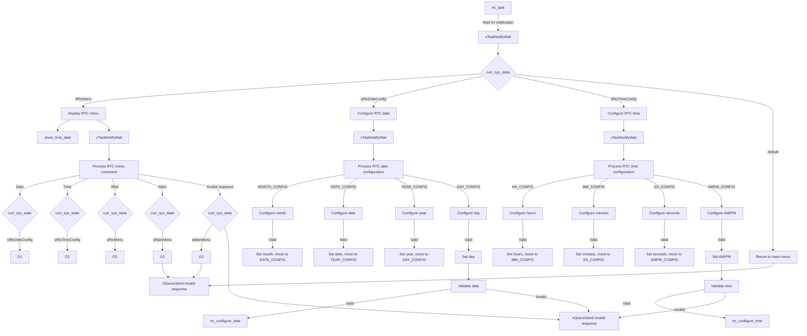

# RtcManager Task Documentation

## RtcManager: rtc task
### Overview
The `rtc_task` is manages the real-time clock (RTC) configuration and display in an STM32F407 FreeRTOS environment. It handles user interactions for viewing and setting the date and time, processes commands, updates the system state accordingly, and ensures proper configuration through validation and confirmation messages.

### Task Description
- **Task Name:** rtc_task
- **Priority:** 2
- **Stack Size:** 1000 bytes (250 words)
- **File Location:** `Core/Src/RtcManager/RtcManager.c`
- **Header File Location:** `Core/Inc/RtcManager/RtcManager.h`
- **Config File Location:** `Core/Inc/RtcManager/Config_RtcManager.h`

### Functionality
#### Purpose

The `rtc_task` performs the following functions:
- Displays the current time and date to the user
- Shows menu options to the user for configuring the date and time
- Processes user inputs to determine what the user wants to do (e.g., set the date, set the time, refresh the display, or return to the main menu)
- Validates the user's input to ensure it's correct and within acceptable ranges
- Configures the RTC with the new date or time if the user input is valid

#### Code Snippet
```c
void rtc_task(void *param)
{
	uint32_t msg_addr;
	message_t *msg;

	while(1) {

		// Wait for notification from another task
		xTaskNotifyWait(0, 0, NULL, portMAX_DELAY);

		while(curr_sys_state != sMainMenu) {

			switch(curr_sys_state) {
				/***** RTC main menu state *****/
				case sRtcMenu:
					// Display RTC menu for the user, show current time and date
					xQueueSend(q_print, &msg_rtc_menu_1, portMAX_DELAY);
					show_time_date();
					xQueueSend(q_print, &msg_rtc_menu_2, portMAX_DELAY);

					// Wait for the user to select their desired RTC configuration option
					xTaskNotifyWait(0, 0, &msg_addr, portMAX_DELAY);
					msg = (message_t*)msg_addr;

					// Process command, update date / time accordingly
					if(msg->len <= 4) {
						if(!strcmp((char*)msg->payload, "Date")) {			// Configure date
							// Update the system state
							curr_sys_state = sRtcDateConfig;
							xQueueSend(q_print, &msg_rtc_mo, portMAX_DELAY);
						}
						else if (!strcmp((char*)msg->payload, "Time")) {	// Configure time
							// Update the system state
							curr_sys_state = sRtcTimeConfig;
							xQueueSend(q_print, &msg_rtc_hh, portMAX_DELAY);
						}
						else if (!strcmp((char*)msg->payload, "Rfsh")) {	// Refresh the date and time
							// Update the system state
							curr_sys_state = sRtcMenu;
						}
						else if (!strcmp((char*)msg->payload, "Main")) {	// Back to main menu
							// Update the system state
							curr_sys_state = sMainMenu;
						}
						else {												// Invalid response
							// Update the system state
							curr_sys_state = sMainMenu;
							xQueueSend(q_print, &msg_inv_rtc, portMAX_DELAY);
						}
					}
					else {
						// If user input is longer than 4 characters, notify user of invalid response
						curr_sys_state = sMainMenu;
						xQueueSend(q_print, &msg_inv_rtc, portMAX_DELAY);
					}
					break;
				/***** RTC date configuration state *****/
				case sRtcDateConfig:
					// Wait for the user to select their desired RTC configuration option
					xTaskNotifyWait(0, 0, &msg_addr, portMAX_DELAY);
					msg = (message_t*)msg_addr;

					// Configure month, date, year, or day of week accordingly
					switch(curr_rtc_state) {
						case MONTH_CONFIG:									// Month config
							uint8_t m = getnumber(msg->payload, msg->len);
							date.Month = m;
							curr_rtc_state = DATE_CONFIG;
							xQueueSend(q_print, &msg_rtc_dd, portMAX_DELAY);
							break;
						case DATE_CONFIG:									// Date config
							uint8_t d = getnumber(msg->payload, msg->len);
							date.Date = d;
							curr_rtc_state = YEAR_CONFIG;
							xQueueSend(q_print, &msg_rtc_yr, portMAX_DELAY);
							break;
						case YEAR_CONFIG:									// Year config
							uint8_t y = getnumber(msg->payload, msg->len);
							date.Year = y;
							curr_rtc_state = DAY_CONFIG;
							xQueueSend(q_print, &msg_rtc_dow, portMAX_DELAY);
							break;
						case DAY_CONFIG:									// Day of week config
							uint8_t day = getnumber(msg->payload, msg->len);
							date.WeekDay = day;

							// Check that the user entered a valid date entry, configure date
							if(!validate_rtc_information(NULL, &date)) {
								rtc_configure_date(&date);
								xQueueSend(q_print, &msg_conf, portMAX_DELAY);
							}
							else {
								xQueueSend(q_print, &msg_inv_rtc, portMAX_DELAY);
							}

							// Update system state, send control back to RTC menu
							curr_sys_state = sRtcMenu;
							curr_rtc_state = 0;
							break;
					}
					break;
				/***** RTC time configuration state *****/
				case sRtcTimeConfig:
					// Wait for the user to select their desired RTC configuration option
					xTaskNotifyWait(0, 0, &msg_addr, portMAX_DELAY);
					msg = (message_t*)msg_addr;

					// Configure hours, minutes, or seconds accordingly
					switch(curr_rtc_state) {
						case HH_CONFIG:
							uint8_t hour = getnumber(msg->payload, msg->len);
							time.Hours = hour;
							curr_rtc_state = MM_CONFIG;
							xQueueSend(q_print, &msg_rtc_mm, portMAX_DELAY);
							break;
						case MM_CONFIG:
							uint8_t min = getnumber(msg->payload, msg->len);
							time.Minutes = min;
							curr_rtc_state = SS_CONFIG;
							xQueueSend(q_print, &msg_rtc_ss, portMAX_DELAY);
							break;
						case SS_CONFIG:
							uint8_t sec = getnumber(msg->payload, msg->len);
							time.Seconds = sec;
							curr_rtc_state = AMPM_CONFIG;
							xQueueSend(q_print, &msg_rtc_ampm, portMAX_DELAY);
							break;
						case AMPM_CONFIG:
							uint8_t opt = getnumber(msg->payload, msg->len);
							time.TimeFormat = opt; // Note: 0 = RTC_HOURFORMAT12_AM, 1 = RTC_HOURFORMAT12_PM
							
							// Check that the user entered a valid date entry, configure time
							if(!validate_rtc_information(&time, NULL)) {
								rtc_configure_time(&time);
								xQueueSend(q_print, &msg_conf, portMAX_DELAY);
							}
							else {
								xQueueSend(q_print, &msg_inv_rtc, portMAX_DELAY);
							}
							// Update system state, send control back to RTC menu
							curr_sys_state = sRtcMenu;
							curr_rtc_state = 0;
							break;
					}
					break;
				default:
					// Return control to the main menu task
					curr_sys_state = sMainMenu;
					xQueueSend(q_print, &msg_inv_rtc, portMAX_DELAY);
					break;
			}

		} // while end

		// Notify the main menu task
		xTaskNotify(handle_main_menu_task, 0, eNoAction);

	} // while super loop end
}
```

## Diagrams

### Data flow diagram


### Sequence diagram

```mermaid
sequenceDiagram
    participant RTCTask
    participant OtherTask
    participant PrintQueue
    participant User
    participant RTC
    participant MainMenuTask

    RTCTask ->> OtherTask: Wait for notification (xTaskNotifyWait)
    OtherTask -->> RTCTask: Notification

    loop Until curr_sys_state == sMainMenu
        alt curr_sys_state == sRtcMenu
            RTCTask ->> PrintQueue: Send RTC menu message 1
            RTCTask ->> RTC: show_time_date()
            RTC ->> PrintQueue: Display time and date
            RTCTask ->> PrintQueue: Send RTC menu message 2
            RTCTask ->> User: Wait for user input (xTaskNotifyWait)
            User -->> RTCTask: User input
            RTCTask ->> RTCTask: Process command
            alt User selects "Date"
                RTCTask ->> PrintQueue: Send month configuration message
                RTCTask ->> RTCTask: Change state to sRtcDateConfig
            else User selects "Time"
                RTCTask ->> PrintQueue: Send hour configuration message
                RTCTask ->> RTCTask: Change state to sRtcTimeConfig
            else User selects "Rfsh"
                RTCTask ->> RTCTask: Refresh time and date
            else User selects "Main"
                RTCTask ->> RTCTask: Change state to sMainMenu
            else Invalid input
                RTCTask ->> PrintQueue: Send invalid response message
                RTCTask ->> RTCTask: Change state to sMainMenu
            end
        else curr_sys_state == sRtcDateConfig
            RTCTask ->> User: Wait for user input (xTaskNotifyWait)
            User -->> RTCTask: User input
            RTCTask ->> RTCTask: Process date configuration
            alt Month configuration
                RTCTask ->> RTCTask: Set month
                RTCTask ->> PrintQueue: Send date configuration message
            else Date configuration
                RTCTask ->> RTCTask: Set date
                RTCTask ->> PrintQueue: Send year configuration message
            else Year configuration
                RTCTask ->> RTCTask: Set year
                RTCTask ->> PrintQueue: Send day configuration message
            else Day configuration
                RTCTask ->> RTCTask: Set day
                RTCTask ->> RTCTask: Validate date
                alt Date valid
                    RTCTask ->> RTC: Configure date (rtc_configure_date)
                    RTC -->> RTCTask: Confirmation
                    RTCTask ->> PrintQueue: Send confirmation message
                else Date invalid
                    RTCTask ->> PrintQueue: Send invalid response message
                end
                RTCTask ->> RTCTask: Change state to sRtcMenu
            end
        else curr_sys_state == sRtcTimeConfig
            RTCTask ->> User: Wait for user input (xTaskNotifyWait)
            User -->> RTCTask: User input
            RTCTask ->> RTCTask: Process time configuration
            alt Hour configuration
                RTCTask ->> RTCTask: Set hours
                RTCTask ->> PrintQueue: Send minute configuration message
            else Minute configuration
                RTCTask ->> RTCTask: Set minutes
                RTCTask ->> PrintQueue: Send second configuration message
            else Second configuration
                RTCTask ->> RTCTask: Set seconds
                RTCTask ->> PrintQueue: Send AM/PM configuration message
            else AM/PM configuration
                RTCTask ->> RTCTask: Set AM/PM
                RTCTask ->> RTCTask: Validate time
                alt Time valid
                    RTCTask ->> RTC: Configure time (rtc_configure_time)
                    RTC -->> RTCTask: Confirmation
                    RTCTask ->> PrintQueue: Send confirmation message
                else Time invalid
                    RTCTask ->> PrintQueue: Send invalid response message
                end
                RTCTask ->> RTCTask: Change state to sRtcMenu
            end
        else
            RTCTask ->> PrintQueue: Send invalid response message
            RTCTask ->> RTCTask: Change state to sMainMenu
        end
    end

    RTCTask ->> MainMenuTask: Notify main menu task

```

