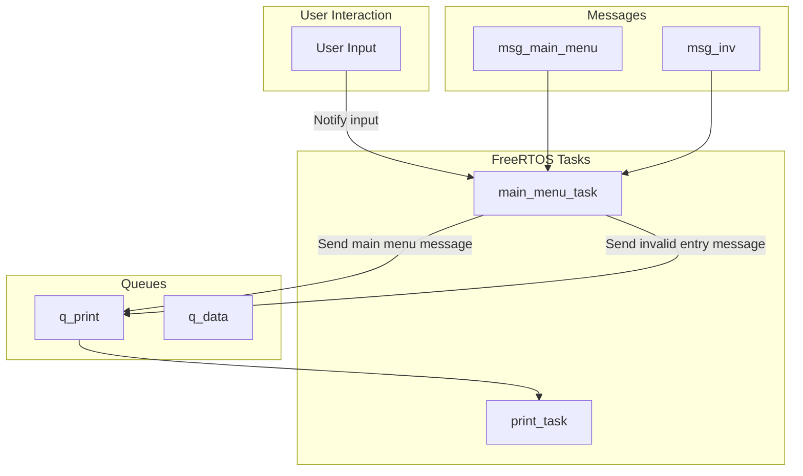
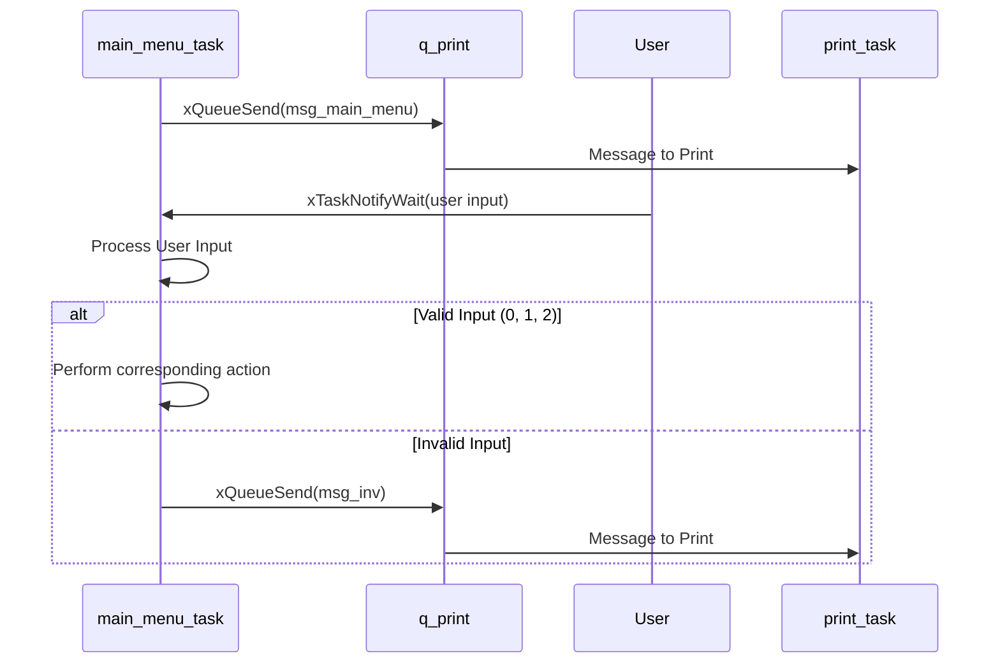

# UartManager Task Documentation

### The baud rate used for all UART communication in this project is *115200*.

## UartManager: message handler task
### Overview
The `main_menu_task` is responsible for presenting the main menu to the user and handling the user response. The main menu task will then pass control to the appropriate sub-menu.

### Task Description
- **Task Name:** main_menu_task
- **Priority:** 2
- **Stack Size:** 1000 bytes (250 words)
- **File Location:** `Core/Src/UartManager/UartManager.c`
- **Header File Location:** `Core/Inc/UartManager/UartManager.h`
- **Config File Location:** `Core/Inc/UartManager/Config_UartManager.h`

### Functionality
#### Purpose
The `main_menu_task` performs the following functions:
- Displays the main menu.
- Waits for user input.
- Processes user input.
- Passes control to the selected sub-menu.

#### Code Snippet
```c
void main_menu_task(void *param)
{
	uint32_t msg_addr;
	message_t *msg;
	int option;

	while(1) {

		xQueueSend(q_print, &msg_main_menu, portMAX_DELAY);

		// Wait for menu commands
		xTaskNotifyWait(0, 0, &msg_addr, portMAX_DELAY);
		msg = (message_t*)msg_addr;

		if(msg->len == 1) {
			// Get user option, convert from ASCII to number
			option = msg->payload[0] - 48;
			switch(option) {
				case 0:
					break;
				case 1:
					break;
				case 2:
					break;
				default:
					xQueueSend(q_print, &msg_inv, portMAX_DELAY);
					continue;
			}
		}
		// Handle invalid entry
		else {
			xQueueSend(q_print, &msg_inv, portMAX_DELAY);
			continue;
		}
	}
}
```

## UartManager: message handler task
### Overview
The `message_handler_task` is responsible for handling all UART transmission and reception operations. This task manages communication between the microcontroller and external devices via the UART interface.

### Task Description
- **Task Name:** message_handler_task
- **Priority:** 2
- **Stack Size:** 1000 bytes (250 words)
- **File Location:** `Core/Src/UartManager/UartManager.c`
- **Header File Location:** `Core/Inc/UartManager/UartManager.h`
- **Config File Location:** `Core/Inc/UartManager/Config_UartManager.h`

### Functionality
#### Purpose
The main application is configured to take care of initialization of the UART peripheral, handling of UART interrupts, and managing the data queue for UART messages.

The `message_handler_task` performs the following functions:
- Waits for notification from the UART interrupt handler
- Receives data from the data queue and processes it accordingly

#### Code Snippet
```c
void message_handler_task(void *param)
{
	BaseType_t ret;
	message_t msg;

	while(1) {

		// Wait until task is notified
		ret = xTaskNotifyWait(0, 0, NULL, portMAX_DELAY);

		if(pdTRUE == ret) {
			// Process the message stored in the input data queue
			process_message(&msg);
		}

	}
}
```

## UartManager: print task
### Overview
The `print_task` is responsible for displaying data to the user via a UART message.

### Task Description
- **Task Name:** print_task
- **Priority:** 2
- **Stack Size:** 1000 bytes (250 words)
- **File Location:** `Core/Src/UartManager/UartManager.c`
- **Header File Location:** `Core/Inc/UartManager/UartManager.h`
- **Config File Location:** `Core/Inc/UartManager/Config_UartManager.h`

### Functionality
#### Purpose
The `print_task` performs the following functions:
- Waits for data to be populated to the print queue (`q_print`)
- Sends data from the print queue to the screen via the STM32 HAL

#### Code Snippet
```c
void print_task(void *param)
{
	uint32_t *msg;

	// Wait for data in the print queue, then send over UART when available
	while(1){
		xQueueReceive(q_print, &msg, portMAX_DELAY);
		HAL_UART_Transmit(&huart2, (uint8_t*)msg, strlen((char*)msg),HAL_MAX_DELAY);
	}
}
```

## Diagrams

### Data flow diagram


### Sequence diagram

