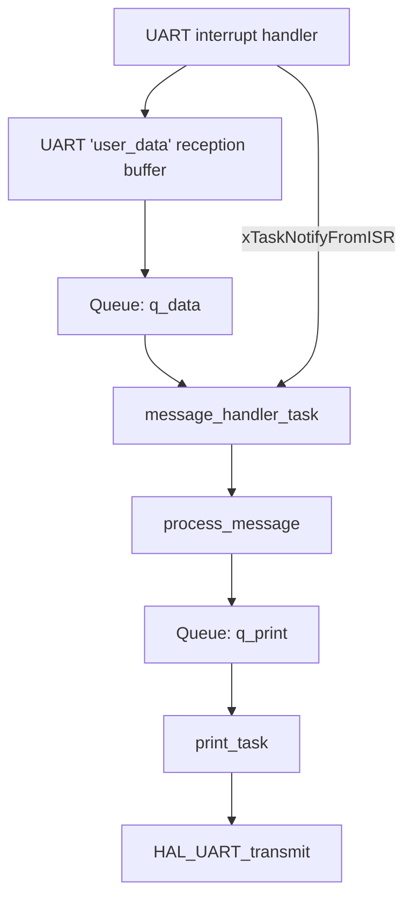
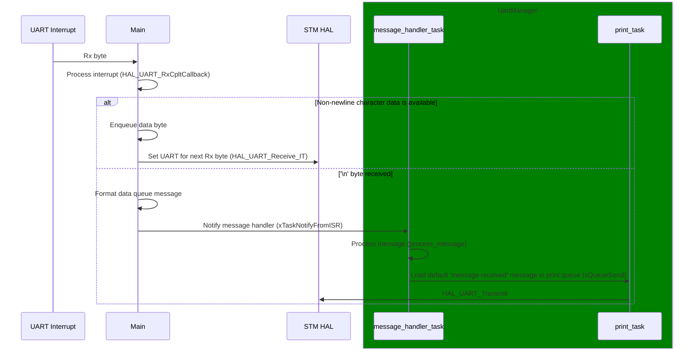

# UartManager Task Documentation

## Overview
The `UartManager` task is responsible for handling all UART transmission and reception operations. This task manages communication between the microcontroller and external devices via the UART interface.

## Task Description
- **Task Name:** UartManager
- **Priority:** [Specify priority]
- **Stack Size:** [Specify stack size]
- **File Location:** `Core/Src/UartManager/UartManager.c`
- **Header File Location:** `Core/Inc/UartManager/UartManager.h`
- **Config File Location:** `Core/Inc/UartManager/Config_UartManager.h`

## Functionality
### Purpose
The `UartManager` task performs the following functions:
- Initializes the UART peripheral.
- Sends and receives data over UART.
- Handles UART interrupts.
- Manages a queue for UART messages.

### Code Snippet
```c
void message_handler_task(void *param)
{
	BaseType_t ret;
	message_t msg;

	while(1) {

		// Wait until task is notified
		ret = xTaskNotifyWait(0, 0, NULL, portMAX_DELAY);

		if(pdTRUE == ret) {
			// Process the message stored in the input data queue
			process_message(&msg);
		}

	}
}
```

## Diagrams

### Data flow diagram


### Sequence diagram

