# User Manual

## Overview
This project creates a menu-based console for interacting with the STM32F407 discovery development board. The available menus and options within each menu are detailed below.

## Table of Contents

1. [Overview](#overview)
2. [Main Menu](#main-menu)
3. [LED Menu](#led-menu)
    - [None](#none)
    - [Effects](#effects)
    - [Toggling LEDs](#toggling-leds)
    - [Main menu](#led-return-to-main-menu)
4. [RTC Menu](#rtc-menu)
    - [Date](#date)
    - [Time](#time)
    - [Refresh](#refresh)
    - [Main menu](#rtc-return-to-main-menu)
5. [Accelerometer Menu](#accelerometer-menu)
    - [X](#x)
    - [Y](#y)
    - [Z](#z)
    - [All](#all)
    - [Main menu](#acc-return-to-main-menu)
6. [Motor Menu](#motor-menu)
    - [Start](#start)
    - [Stop](#stop)
    - [Algo](#algo)
    - [Param](#param)
    - [Rec](#rec)
    - [Speed](#speed)
    - [Main menu](#motor-return-to-main-menu)
7. [SEGGER SystemView Traces](#segger-systemview-traces)
    - [Overview](#overview-1)
    - [SEGGER SystemView in this project](#segger-systemview-in-this-project)
    - [SystemView setup](#systemview-setup)
    - [Target setup](#target-setup)
    - [Generating a SystemView trace](#generating-a-systemview-trace)

## Main Menu

The main menu is where the whole application starts. It displays options to start of modify an LED effect, configure the RTC, and read from the accelerometer. The proper input to select any of these options is the number shown on the left for that particular option. Entering anything else (or a number that's not available in the main menu) will be subject to error handling.

  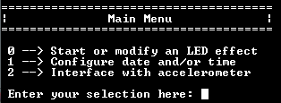

## LED Menu

The LED menu shows all possible pre-programmed LED effects and capabilities. These can be further broken down into four effects (detailed below), the ability to change the frequency of an effect, and the ability to toggle individual LEDs.

  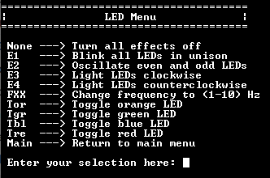

### None

Entering `None` will turn off all LEDs and stop all effect timers.

### Effects

Each of the four pre-programmed effects is illustrated below.

* **Effect #1**: Blink all LEDs in unison

  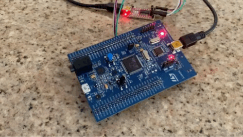

* **Effect #2**: Alternate blinking pairs of opposite LEDs

  

* **Effect #3**: Rotate a single illuminated LED clockwise around the circle of LEDs

  

* **Effect #4**: Rotate a single illuminated LED counterclockwise around the circle of LEDs

  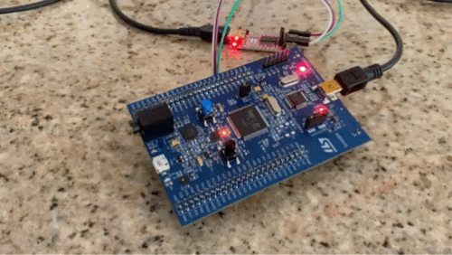

* **Frequency adjustment**: For any of the above effects, the frequency of the effect can be modified using this command. It takes the form FXX, where XX represents the frequency (from 1 to 10, in Hz) that you'd like to set for the current LED effect. For instance, selecting E4 (turn on Effect #4) and then selecting F10 (set frequency to 10 Hz) would produce a much faster Effect #4, as shown below.

  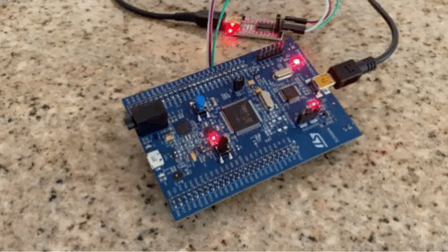

Note that each effect "remembers" its last set frequency. Therefore, if you set the effect to E4, then set the frequency to F10, Effect #4 "remembers" its frequency. If you were to switch to Effect #1 and then back to Effect #4, Effect #4 would maintain the last set frequency (in this case, 10 Hz).

### Toggling LEDs

Each LED can also be individually toggled. The menu options are shortened versions of each LED color, so Tor toggles the orange LED, Tgr toggles the green LED, etc.

Sending a toggle command disables all software timers, so any existing effect will stop. If there are any "residual" LEDs still on from the existing effect when the toggle command is sent, they will remain on; the toggle command does not turn them off.

### LED: return to Main Menu

Selecting `Main` will bring you back to the main menu.

## RTC Menu

The real time clock (RTC) menu allows for configuration of the RTC and display of the date and time.

  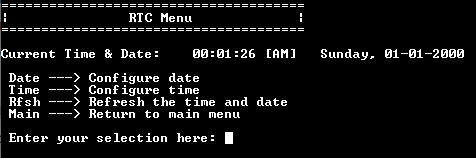

### Date

Date configuration is guided by the application, which prompts for month, day, year, and then day of the week, per below:
- Sunday = 1
- Monday = 2
- Tuesday = 3
- Wednesday = 4
- Thursday = 5
- Friday = 6
- Saturday = 7

### Time

Time configuration is also guided by the application, which prompts for hours, minutes, seconds, and AM / PM.

### Refresh

This simply refreshes the displayed date and time. If you set the RTC time and wanted to refresh the display a few seconds later, this is the command you would use.

### RTC: return to Main Menu

Selecting `Main` will bring you back to the main menu.

## Accelerometer Menu

The STM32F407 discovery board comes pre-populated with an on-board LIS302DL MEMS accelerometer. The accelerometer menu allows for reading of any of the axes individually or reading all axes together via SPI communication with the accelerometer.

  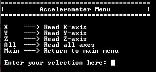

### X

Display the accelerometer reading for the X-axis.

### Y

Display the accelerometer reading for the Y-axis.

### Z

Display the accelerometer reading for the Z-axis.

### All

Display the accelerometer reading for all axes.

### Acc: return to Main Menu

Selecting `Main` will bring you back to the main menu.

## Motor Menu

This menu allows for interfacing with the only truly external device included in this project to date, which is a [Pololu 350 RPM, 12V, DC, 30:1 Metal Gearmotor with 64 CPR encoder](https://www.pololu.com/product/1443). This device requires proper electrical setup, so be sure to check the [system schematic](Img/SystemSchematic.png) for wiring details.

  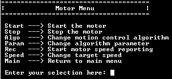

At any point, in the case of emergency, if the 12V power is cut off to the motor driver, the motor will stop spinning immediately.

### Start

Sending the `Start` command sets the `curr_motor_state` to `MOTOR_ACTIVE` and configures the H-bridge motor driver to supply power to the motor (i.e. sets IN1 low and IN2 high on the H-bridge). Note that 12V must be supplied prior to sending this command or the motor won't start spinning.

### Stop

Sending the `Stop` command sets the `curr_motor_state` to `MOTOR_INACTIVE` and configures the H-bridge motor driver to stop supplying power to the motor (i.e. sets both IN1 and IN2 lower on the H-bridge). 

### Algo

Sending the `Algo` command will allow for selection of the motion control algorithm, which is currently configured with only two available options: no motion control at all (`0`, corresponding to `None`), and PID motion control (`1`, corresponding to `PID`). Selecting `None` will turn off all algorithms, which is helpful in observing the discrepancy between the desired target speed and the actual rotational speed of the motor (predominantly due to the voltage drop within the H-bridge motor driver). Selecting `PID` will turn on PID motion control, which by default is only proportional control (no derivative or integral control), which will then allow the system to use feedback to adjust the PWM signal applied to the H-bridge motor driver to fine tune and stabilize the motor rotational speed.

### Param

Sending the `Param` command will allow for modification of the algorithm parameters. Given that the system currently incorporates only (1) no algorithms in place and (2) PID motion control, the parameter list is limited to `Kp`, `Kd`, and `Ki`. Each of these values can be adjusted from `0.000` to `9.999`. While the majority of this range will result in unstable systems, this project is intentionally developed as a learning platform to allow the user to observe the effects of a variety of parameters in the context of PID motion control for DC motor rotational speed.

### Rec

Sending the `Rec` command will start motor speed logging to the terminal window. The `curr_motor_state` is first set to `MOTOR_SPEED_REPORTING`, then an introductory report is published to the terminal noting the target speed, Kp value, Kd value, and Ki value. While the report is running, the MCU is calculating statistics behind the scenes. As soon as the user presses any key to stop speed logging, a summary statistics report is published detailing the elapsed time (sec); minimum, maximum, and average rotational speed (RPM) observed within the logging window; and standard deviation of rotational speed (RPM) during the logging window. Note that the elapsed time is counted via an `int` variable, so the maximum logging window is therefore 2,147,483,647 seconds ~= 68 years. However, the logging window will appear to roll over after every `999` seconds, as the elapsed time is shown as only a 3-digit value.

### Speed

Sending the `Speed` command allows for updating the system `target_speed`. If the desired target speed is larger than `MAX_MOTOR_SPEED`, the target speed will automatically be set to `MAX_MOTOR_SPEED`. This `MAX_MOTOR_SPEED` can be configured in `Config_MotorManager.h`, but note the practical limitation; although the maximum motor speed is rated for 350 RPM, the motor will not see the full 12V needed to achieve this speed due to the voltage drop across the H-bridge motor driver.

Additionally, be mindful that unless a motion control algorithm is active, setting the target speed will have no effect on the output rotational speed of the motor. 

### Motor: return to Main Menu

Selecting `Main` will bring you back to the main menu.

## SEGGER SystemView traces

### Overview

SEGGER SystemView is a real-time recording and visualization tool designed for embedded systems. It provides comprehensive insight into the runtime behavior of an application, allowing developers to analyze system performance and visualize system events in real-time, analyze task execution and interrupt handling to identify and resolve performance bottlenecks, and optimize their code for improved system efficiency and reliability.

Some of the key features include:

* **Real-Time Recording:** Captures events in real-time with minimal overhead, ensuring accurate and detailed data collection without significantly impacting system performance.
* **Event Visualization:** Offers a graphical view of recorded events, including interrupts, task switches, API calls, and user-defined events. This helps in understanding the sequence and timing of operations within the system.
* **Performance Analysis:** Enables in-depth analysis of system performance metrics such as CPU load, task execution time, and interrupt latency. This aids in identifying performance issues and optimizing system efficiency.
* **Integrations:** Compatible with various RTOS environments, including FreeRTOS, embOS, and others, providing flexibility for different development platforms.
* **User-Friendly Interface:** Features an intuitive GUI that simplifies navigation and analysis, making it accessible to both novice and experienced developers.

This allows for several benefits, including:

* **Enhanced Debugging:** Facilitates the identification and resolution of complex bugs and performance issues through detailed event tracking and analysis.
* **Improved Efficiency:** Helps optimize code and system performance by providing actionable insights into runtime behavior and system resource usage.
* **Reduced Development Time:** Streamlines the debugging and optimization process, leading to faster development cycles and quicker time-to-market.

### SEGGER SystemView in this project

The purpose of incorporating SEGGER SystemView into this project is to demonstrate the ability to leverage the advanced debugging and performance analysis tools that SystemView provides. This project uses the SystemView real time transfer (RTT) buffer to store the SEGGER data to a particular memory address, which can then be exported from STM32CubeIDE and imported into SEGGER SystemView. It's possible to do real-time capture and visualization of system events with SystemView, this simply requires the setup of an additional UART interface that was not considered in the scope of this project.

### SystemView setup

If not already on your machine, you'll need to download SEGGER SystemView from their [website](https://www.segger.com/products/development-tools/systemview/). SEGGER's [license structure](https://www.segger.com/products/development-tools/systemview/license/systemview-installation/) makes this software free for non-commercial use under their [SEGGER's Friendly License (SFL)](https://www.segger.com/purchase/licensing/license-sfl/). Given that this project is solely for educational purposes, the SFL applies here.

SEGGER SystemView is available for Mac, Windows, and Linux. At the time of this writing, the latest version (and the version used in this project) is V3.54.

### Target setup

An STM32CubeIDE project doesn't natively support SEGGER SystemView analysis. To add this capability, the SystemView source files must be copied into the project, SystemView must be initialized correctly, the integration steps for FreeRTOS must be followed, the system configuration must be modified, etc. Fortunately, this is all taken care of in this project, so these steps can all be skipped.

However, the SEGGER data logs themselves are not automatic. The next section details how to generate a SEGGER-compatible memory dump from STM32CubeIDE.

### Generating a SystemView trace

The following steps detail how to generate a SEGGER SystemView trace in this project.

1. **Debug:** Select the Debug icon to start running the code on the STM32F407 discovery board.
2. **Pause:** After the code has been running for at least a few seconds, pause the code.
3. **SEGGER RTT buffer:** If you don't already have the *Expressions* window visible, turn it on via `Window` > `Show View` > `Expressions`. 

  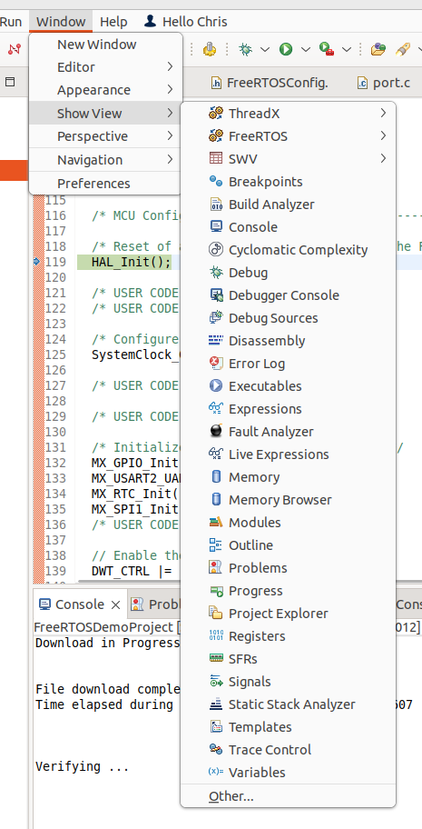

Then add *_SEGGER_RTT* to the Expressions window. Drill down within the RTT buffer to the *pBuffer* address, shown below. This is the address that we'll pull memory from. Copy the address for the next step.

Also note the contents of the Write Offset (WrOff). This tells you how many bytes are in the RTT buffer.

  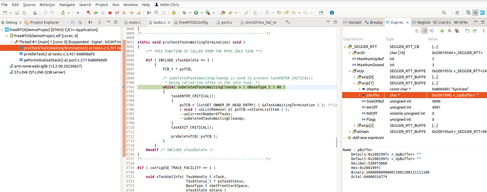

4. **Memory Browser:** If you don't already have the *Memory Browser* window available, turn it on via `Window` > `Show View` > `Memory Browser`. Note that *Memory Browser* is not the same as *Memory*.

Paste the *pBuffer* address in the *Memory Browser* window and hit the return key. The *Memory Browser* window should not be populated with a variety of data starting at the *pBuffer* address.

  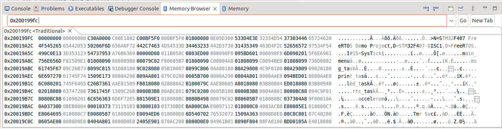

5. **Export the data:** To view this system event data in SEGGER SystemView, you'll need to export it from the *Memory Browser*. To do so, select the *Export* button in the top right of the *Memory Browser* window. In the *Export* pop-up menu, ensure the following configuration:

* **Format**: RAW Binary
* **Start address**: The *pBuffer* address from earlier
* **Length**: The value stored in *WrOff*
* **Filename**: Must end in *.SVdat*

This is illustrated below:

  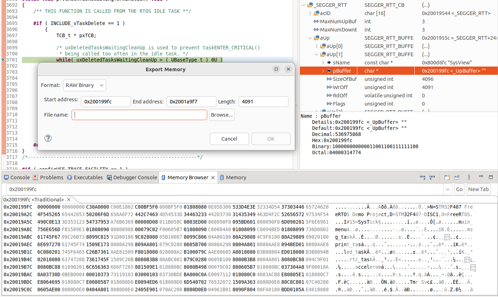

6. **Open in SystemView:** In SystemView, select `File` > `Load Data` and navigate to your record *.SVdat* file. This will open the SEGGER SystemView data visualization of this project running on the STM32F407 discovery board.

Below is an example of a SEGGER SystemView visualization for this project. In this particular screenshot, the SysTick had just run and recognized that the `led_task` was in the ready state, then set `led_task` to run on the processor. The `led_task` runs its initial block of code before getting to `xTaskNotifyWait` and goes into the blocked state until notified by another task.

  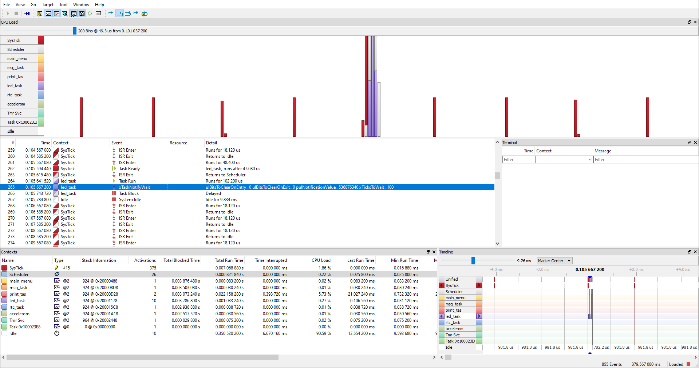

In this snapshot, you can also see that the application spends more than 90% of the time in the Idle task.