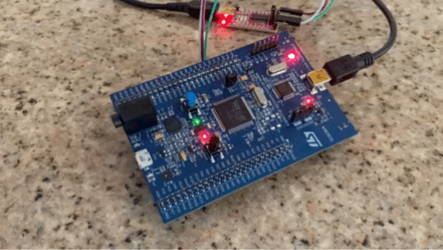
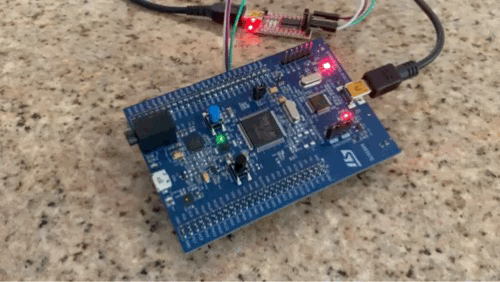

# User Manual

## Overview
This project creates a menu-based console for interacting with the STM32F407 discovery development board. The available menus and options within each menu are detailed below.

## Table of Contents

1. [Overview](#overview)
2. [Main Menu](#main-menu)
3. [LED Menu](#led-menu)
    - [None](#none)
    - [Effects](#effects)
    - [Toggling LEDs](#toggling-leds)
    - [Main menu](#led-return-to-main-menu)
4. [RTC Menu](#rtc-menu)
    - [Date](#date)
    - [Time](#time)
    - [Refresh](#refresh)
    - [Main menu](#rtc-return-to-main-menu)
5. [Accelerometer Menu](#accelerometer-menu)
    - [X](#x)
    - [Y](#y)
    - [Z](#z)
    - [All](#all)
    - [Main menu](#acc-return-to-main-menu)

## Main Menu

The main menu is where the whole application starts. It displays options to start of modify an LED effect, configure the RTC, and read from the accelerometer. The proper input to select any of these options is the number shown on the left for that particular option. Entering anything else (or a number that's not available in the main menu) will be subject to error handling.

  

## LED Menu

The LED menu shows all possible pre-programmed LED effects and capabilities. These can be further broken down into four effects (detailed below), the ability to change the frequency of an effect, and the ability to toggle individual LEDs.

  

### None

Entering `None` will turn off all LEDs and stop all effect timers.

### Effects

Each of the four pre-programmed effects is illustrated below.

* **Effect #1**: Blink all LEDs in unison

  

* **Effect #2**: Alternate blinking pairs of opposite LEDs

  

* **Effect #3**: Rotate a single illuminated LED clockwise around the circle of LEDs

  

* **Effect #4**: Rotate a single illuminated LED counterclockwise around the circle of LEDs

  

* **Frequency adjustment**: For any of the above effects, the frequency of the effect can be modified using this command. It takes the form FXX, where XX represents the frequency (from 1 to 10, in Hz) that you'd like to set for the current LED effect. For instance, selecting E4 (turn on Effect #4) and then selecting F10 (set frequency to 10 Hz) would produce a much faster Effect #4, as shown below.

  

Note that each effect "remembers" its last set frequency. Therefore, if you set the effect to E4, then set the frequency to F10, Effect #4 "remembers" its frequency. If you were to switch to Effect #1 and then back to Effect #4, Effect #4 would maintain the last set frequency (in this case, 10 Hz).

### Toggling LEDs

Each LED can also be individually toggled. The menu options are shortened versions of each LED color, so Tor toggles the orange LED, Tgr toggles the green LED, etc.

Sending a toggle command disables all software timers, so any existing effect will stop. If there are any "residual" LEDs still on from the existing effect when the toggle command is sent, they will remain on; the toggle command does not turn them off.

### LED: return to Main Menu

Selecting `Main` will bring you back to the main menu.

## RTC Menu

The real time clock (RTC) menu allows for configuration of the RTC and display of the date and time.

  

### Date

Date configuration is guided by the application, which prompts for month, day, year, and then day of the week, per below:
- Sunday = 1
- Monday = 2
- Tuesday = 3
- Wednesday = 4
- Thursday = 5
- Friday = 6
- Saturday = 7

### Time

Time configuration is also guided by the application, which prompts for hours, minutes, seconds, and AM / PM.

### Refresh

This simply refreshes the displayed date and time. If you set the RTC time and wanted to refresh the display a few seconds later, this is the command you would use.

### RTC: return to Main Menu

Selecting `Main` will bring you back to the main menu.

## Accelerometer Menu

The accelerometer menu allows for reading of any of the axes individually or reading all axes together.

  

### X

Display the accelerometer reading for the X-axis.

### Y

Display the accelerometer reading for the Y-axis.

### Z

Display the accelerometer reading for the Z-axis.

### All

Display the accelerometer reading for all axes.

### Acc: return to Main Menu

Selecting `Main` will bring you back to the main menu.