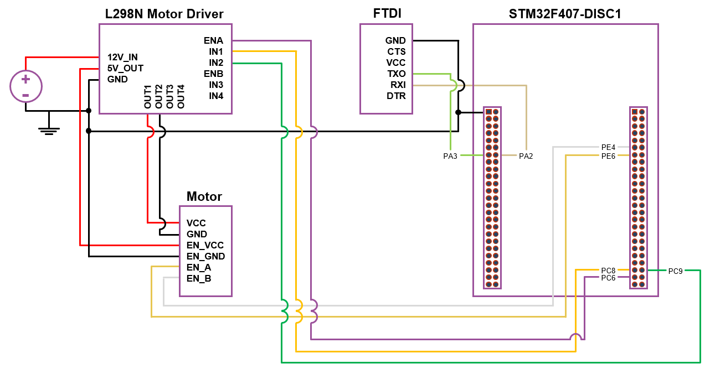
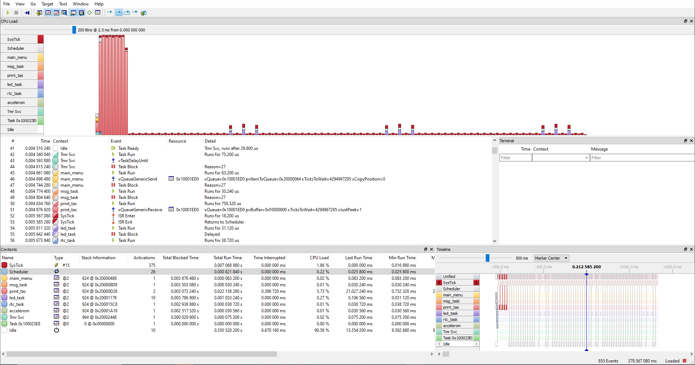

# STM32F407 FreeRTOS Demo Project

## Overview
This project is intended to demonstrate a variety of the features available within FreeRTOS and the STM32F407 discovery board, such as on-board LEDs, the real-time clock, discovery board accelerometer, and external DC motor. The project is intentionally limited to the STM32F407 discovery board with limited (optional) external components to minimize the amount of hardware required to set up the project and run. The application is rather simple, given that we're just exploring the development board and not necessarily "achieving" anything functional. Nonetheless, the project sets up multiple tasks to interact with various peripherals (ex. GPIO, UART, and RTC) and therefore hopefully serves as a somewhat comprehensive example of FreeRTOS in action, highlighting task management, inter-task communication, and peripheral interfacing.

With the addition of motion control and interaction with the external DC motor in V1.1, this project can also be used as an educational platform for mechanical, electrical, or embedded software engineering students looking for a tangible system for intuitively grasping the intricacies and subtleties of PID motion control and beyond; as a rich debugging platform for learning interdisciplinary embedded system troubleshooting; as a simple circuitry project to understand basic concepts of electrical circuits, PWM, and control systems; and likely in a variety of other ways in an educational setting.

**If you're interested in using this project in the context of a college course or similar, please feel free to reach out.** I would very much appreciate the opportunity to bring the joy of real-time operating systems and embedded software to the next generation of engineers, builders, and makers.

## Table of Contents

1. [Overview](#overview)
2. [Features](#features)
3. [Hardware and Software Requirements](#hardware-and-software-requirements)
4. [Project Structure](#project-structure)
5. [Getting Started](#getting-started)
   - [Prerequisites](#prerequisites)
   - [Installlation](#installation)
   - [Hardware Setup](#hardware-setup)
   - [Terminal Setup](#terminal-setup)
   - [Running the Application](#running-the-application)
   - [Using the Application](#using-the-application)
   - [Analyzing with SEGGER SystemView](#analyzing-with-segger-systemview)
6. [Task Descriptions](#task-descriptions)
   - [Motor Manager](#motor-manager-_______________________________________________________)
   - [Accelerometer Manager](#accelerometer-manager-_______________________________________________)
   - [LED Manager](#led-manager-__________________________________________________________)
   - [RTC Manager](#rtc-manager-__________________________________________________________)
   - [UART Manager](#uart-manager-_________________________________________________________)
7. [Communication Mechanisms](#communication-mechanisms)
8. [Diagrams](#diagrams)
9. [License](#license)
10. [Contact](#contact)
11. [Acknowledgements](#acknowledgements)

## Features
- **Task Management:** Demonstrates the creation and management of multiple FreeRTOS tasks.
- **Queue Management:** Demonstrates the creation and management of multiple FreeRTOS queues, one a "data queue" and the other a "print queue".
- **Inter-Task Communication:** Utilizes queues, semaphores, event groups, and other FreeRTOS synchronization mechanisms.
- **Peripheral Control:** Interfaces with GPIO, UART, STM32F407DISC-1 accelerometer (SPI), and RTC peripherals.

## Hardware and Software Requirements
- **Hardware:** STM32F407 Discovery Board, FTDI USB-to-UART converter, USB cables
- **Optional additioanl hardware (DC motor motion control):** 12V DC motor with quadrature encoder, L298N H-bridge motor controller
- **Software:** STM32CubeIDE, FreeRTOS library, HAL drivers for STM32

## Project Structure
```
FreeRTOSDemoProject/
├── Binaries/
├── Includes/
├── Core/
│ ├── Inc/
│ │ ├── FreeRTOSConfig.h
│ │ ├── main.h
│ │ ├── stm32f4xx_hal_conf.h
│ │ └── stm32f4xx_it.h
│ ├── Src/
│ │ ├── AccManager/
| | | ├── Config_AccManager.h
| | | ├── AccManager.h
| | | └── AccManager.c
│ │ ├── LedManager/
| | | ├── Config_LedManager.h
| | | ├── LedManager.h
| | | └── LedManager.c
│ │ ├── RtcManager/
| | | ├── Config_RtcManager.h
| | | ├── RtcManager.h
| | | └── RtcManager.c
│ │ ├── UartManager/
| | | ├── Config_UartManager.h
| | | ├── UartManager.h
| | | └── UartManager.c
│ │ ├── MotorManager/
| | | ├── Config_MotorManager.h
| | | ├── MotorManager.h
| | | └── MotorManager.c
│ │ ├── main.c
│ │ ├── stm32f4xx_hal_msp.c
│ │ ├── stm32f4xx_hal_timebase_tim.c
│ │ ├── stm32f4xx_it.c
│ │ ├── syscalls.c
│ │ ├── sysmem.c
│ │ └── system_stm32f4xx.c
| ├── Startup/
├── Debug/
├── Drivers/
│ ├── CMSIS/
│ └── STM32F4XX_HAL_Driver/
├── ThirdParty/
│ └── FreeRTOS/
├── Debug/
├── Docs/
│ ├── Communication/
│ │ ├── EventGroups.md
│ │ ├── Queues.md
│ │ └── Semaphores.md
│ └── Tasks/
│ │ ├── AccManager.md
│ │ ├── LedManager.md
│ │ ├── RtcManager.md
│ │ └── UartManager.md
└── README.md
```

## Getting Started

### Prerequisites
- **STM32CubeIDE:** Install from [STMicroelectronics](https://www.st.com/en/development-tools/stm32cubeide.html).
- **FreeRTOS:** Ensure FreeRTOS is included in your project setup. In my case, I set this up manually, but you can also use the STM32CubeIDE to semi-automatically configure FreeRTOS for you.

### Installation
1. **Clone the repository:**
   ```bash
   git clone https://github.com/yourusername/STM32F407_FreeRTOS_Project.git
2. **Open the project in STM32CubeIDE.**
- Open the generated project in STM32CubeIDE or your preferred IDE.
3. **Build the project by clicking on the build icon or using the menu Project -> Build All.**
- Compile the project to generate the binary file.
4. **Flash the firmware to your STM32F407 Discovery board using the debug icon or menu Run -> Debug.**
- Connect the board to your PC via USB.
- Flash the binary using the IDE's built-in programmer or any other programming tool.

### Hardware setup
This project handles all user communication via UART (**USART2** in the STM32CubeIDE Device Configuration Tool). This uses pins **PA2 (USART2_TX)** and **PA3 (USART2_RX)**, which must be connected to the RX and TX pins of your FTDI USB-to-UART converter. You must also ensure the FTDI USB-to-UART converter and the STM32F407 discovery board share a ground, so you'll need to add an additional jumper wire to ensure a common ground.
### Terminal setup
For this project, I used Tera Term on a Windows machine for all communication to / from the board, however any terminal emulator will work (for instance, I also tested this using picocom on a Linux machine running Ubuntu). You'll want to set up the terminal emulator the following way to facilitate UART communication:
- Turn on line feed (LF) for both _Receive_ and _Transmit_. In Tera Term, you can find this at `Setup > Terminal...`, then select `LF` for _Receive_ and `LF` for _Transmit_
- Turn on a local echo. In Tera Term, you can find this at `Setup > Terminal...`, then check the box for _Local echo_
- Set the baud rate to 115,200. In Tera Term, you can find this at `Setup > Serial port...`, then use the drop-down menu to change _Speed_ to **115200**

### System wiring
The schematic below shows the system wiring, including communication and interfacing with the external DC motor.
<p align="center">
  
</p>

### Running the Application
Upon powering the STM32F407 Discovery board, the FreeRTOS scheduler will start, and the tasks will begin execution as described below. You can tell if you've set up UART communication correctly if you're presented with a main menu upon powering up the board. If you don't see the main menu, try resetting the board while the FTDI connector is already connected.

### Using the Application
The [User Manual](FreeRTOSDemoProject/Docs/UserManual.md) details how to actually use the application, including LED manipulation, RTC configuration, and accelerometer data collection.

### Analyzing with SEGGER SystemView
SEGGER SystemView is a real-time recording and visualization tool designed for embedded systems. It provides comprehensive insight into the runtime behavior of an application, allowing developers to analyze system performance and visualize system events in real-time, analyze task execution and interrupt handling to identify and resolve performance bottlenecks, and optimize their code for improved system efficiency and reliability.

SEGGER SystemView is already integrated into this project. The [User Manual](FreeRTOSDemoProject/Docs/UserManual.md) contains instructions on how to capture data, export, and load a trace into SEGGER SystemView for analysis. Below is an example screenshot of task creation in this project, viewed in SEGGER SystemView (note: this application spends a lot of time in the Idle task).

<p align="center">
  
</p>

## Task Descriptions

### Motor Manager _______________________________________________________

    File: Core/Src/MotorManager/MotorManager.c
    Description: Handles interaction with the 12V DC motor with quadrature encoder, including motion control.
    Documentation: MotorManager.md

#### Motor Task (`motor_task`)
- Manages motor commands and motion control.

### Accelerometer Manager _______________________________________________

    File: Core/Src/AccManager/AccManager.c
    Description: Handles interaction with the STM32F407 discovery board accelerometer via SPI communication.
    Documentation: AccManager.md

#### Accelerometer Task (`acc_task`)
- Processes accelerometer data and triggers related events.

### LED Manager __________________________________________________________

    File: Core/Src/LedManager/LedManager.c
    Description: Handles management of the four on-board LEDs.
    Documentation: LedManager.md

#### LED Task (`led_task`)
- Manages LED states and effects based on notifications, user input, events, and semaphores.

### RTC Manager __________________________________________________________

    File: Core/Src/RtcManager/RtcManager.c
    Description: Handles configuration of the real time clock.
    Documentation: RtcManager.md

#### RTC Task (`rtc_task`)
- Manages RTC configurations and synchronization events.

### UART Manager _________________________________________________________

    File: Core/Src/UartManager/UartManager.c
    Description: Handles UART transmission and reception.
    Documentation: UartManager.md

#### Main Menu Task (`main_menu_task`)
- Handles the main menu interactions and state transitions.

#### Message Handler Task (`message_handler_task`)
- Processes incoming UART messages and notifies other tasks accordingly.

#### Print Task (`print_task`)
- Handles print operations to the UART for debugging and user messages.

## Communication Mechanisms

- **Queues:**
    - `q_print`: Used for handling print operations.
    - `q_data`: Used for managing UART data reception.
- **Event Groups:**
    - `ledEventGroup`: Synchronizes accelerometer readings with LED triggers.
- **Semaphores:**
    - `rtcSemaphore`: Ensures safe access to RTC configurations.
    - `ledOffSemaphore`: Coordinates turning off LEDs after exiting the RTC menu.
- **Timers:**
    `handle_led_timer[]`: Software timers for controlling LED effects.

## Diagrams

See [task](FreeRTOSDemoProject/Docs/Tasks) and [communication](FreeRTOSDemoProject/Docs/Communication) documentation for data flow and sequence diagrams.

## License

This project is licensed under the [MIT License](https://opensource.org/license/MIT).

## Contact

Christopher Coyne: christopher.w.coyne@gmail.com  
Project Link: https://github.com/c-coyne/stm32f407-freertos-demo

## Acknowledgements

**FreeRTOS:** FreeRTOS.org

**STM32CubeIDE:** STMicroelectronics

**FastBit Embedded Brain Academy:** This project is a modified and heavily extended version of one of the many projects in their [_Mastering FreeRTOS: Hands on FreeRTOS and STM32Fx with Debugging_](https://www.udemy.com/course/mastering-rtos-hands-on-with-freertos-arduino-and-stm32fx/?couponCode=ST18MT62524) course.

